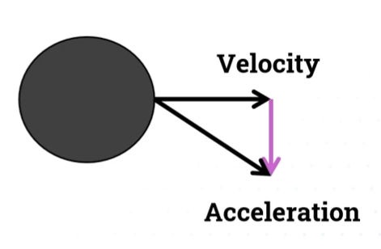
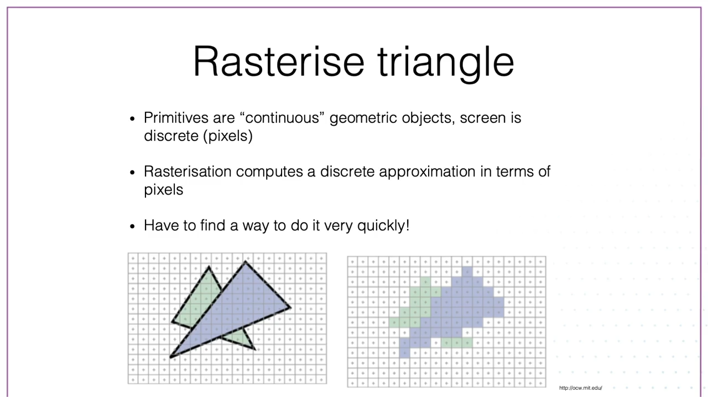
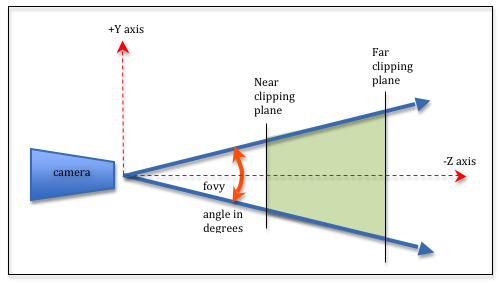
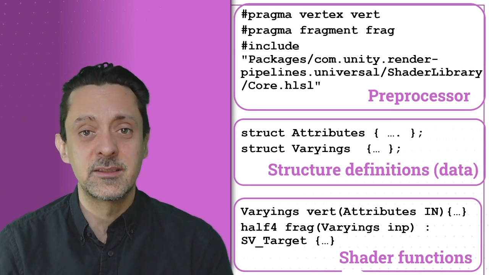

# 3D Graphics & Animation

Lecturers: Dr. M. Gillies, Dr. S. Pan

## Notes
Assessment:
- Coursework 50%
  - Midterm assignment 35% (based on labs)
  - Midterm quiz 10%
  - Topic quizzes 5% total
- Exam 50%

Note: Things covered in the peer-review labs may/will show up in the exam.

Resources:
- Textures and Materials - [Poly Haven](https://polyhaven.com/)
- [Alan Zucconi tutorials](https://www.alanzucconi.com/tutorials/)
  - [A gentle introduction to shaders in Unity3D](https://www.alanzucconi.com/2015/06/10/a-gentle-introduction-to-shaders-in-unity3d/)

## Week 1

The length or magnitude of a vector $a = (x,y)$ is $\|a\| = \sqrt{x^2 + y^2}$

The direction of a vector is another vector (unit) with a length of 1. It can be obtained by dividing each projection (x,y) by the magnitude. This process is called **normalisation**.

If $a$ is a vector and $a'$ its unit vector, then:
- $a' = \frac{a}{\|a\|}$
- $a = a' * \|a\|$

### Vector operations
#### Scaling 
$a * 1.5 \equiv (x_a * 1.5, y_a * 1.5)$

#### Addition 
$a+b = (x_a+x_b, y_a+y_b)$ (commutative)


#### Subtraction

$a-b = (x_a-x_b, y_a-y_b)$
Note: not commutative, $a-b$ has the same magnitude but opposite direction to $b-a$


#### Dot product
$a \cdot b = x_a * x_b + y_a * y_b$

- for unit vectors $u_1 \cdot u_2 = cos (\Phi)$, where Phi is the angle between them
- $a \cdot b = \|a\|\|b\| \cos(\Phi)$
- $\cos(\Phi) = \frac{a \cdot b}{\|a\|*\|b\|}$


#### Cross product

The cross product of two vectors $a \times b$ is a vector $c$ that is *perpendicular* to the two. The direction can be determined using the right-hand rule.

$a \times b = \|a\| * \|b\| \sin(\varphi) * n$, where n is a unit vector perpendicular to both

$\|c\| = \|a \times b\| = \|a\|\|b\|\sin(\varphi)$


<table>
<tr>
  <td></td>
  <td></td>
</tr>
</table>

Note: The operation is not commutative as the direction given by $n$ changes.

## Week 2
In 3D space objects are made out of:
- vertices (points)
- edges (connected vertices)
- polygons (connected edges)
- meshes (the actual 3D object)

### Unity basics
**Unity hotkeys**
*f* - focus on selected object
*w* - move object
*r* - scale object
*e* - rotate object
*v* - snap objects by vertex

## Week 3
### Unity basics
Coordinate systems
- *World* - position of an object in the 3D world, `Vector3`
- *Screen* - where the object appears on the screen, `Vector2` in pixels
- *View* - similar to screen but an app can have multiple views (cameras), `Vector2` in $0-1$

A `GameObject` is a *container* for game objects or components. By placing different components in an empty `GameObject` we can replicate the built-in objects (Cube, Plane, Sphere, etc.). All `GameObject` will have at least 1 component, the `Transform`.

Data from other components can be directly referenced in scripts. For example from the `Transform`:

```c#
void Start() {
  Debug.Log("Position: " + transform.position);
}
```

`MonoBehaviour` is the base class from which all Unity scripts derive.


**Transforms** are used to manipulate the position (translation), orientation (rotation, reflection), size (scaling) and shape (shearing/skew) of objects in a scene.

They use matrices to modify objects' geometry without altering the actual object data.

Transforms can be accessed in any Unity GameObject: `transform.position`, `transform.rotation`, `transform.localScale`.

**Lights:**
- Directional light - like the sun, position and scale don't matter, rotation does
- Point light - like a light bulb, position matters, scale and rotation don't
- Spot light - intensity decreases over length, scale doesn't matter, position and rotation do
- Area light - a flat plane which emits light from one side, unlike the other this is a type of *baked* lighting


Note: The skybox will add a small amount of ambient light to the scene.

Public properties defined for a component class are editable in the Unity inspector. 
Private properties can also be viewed if they're marked with `[SerializeField]`.

Useful functions:
- Call methods from another component class in the same game object: `GetComponent<ClassName>().method()`
- Search globally by name for a game object `GameObject.Find("objectName")`
- Check if key was pressed: `Input.GetKeyDown("space")`, returns a *boolean*

## Week 4
### Matrices
Matrix **transposition** means turning a matrixes rows into columns. Ex: 1st row becomes 1st column, 2nd row becomes 2nd column, etc.

**Scaling** a matrix means multiplying each element by the same number. 

$$z * \big(\begin{smallmatrix}
  a & b\\
  c & d
\end{smallmatrix}\big) =
\big(\begin{smallmatrix}
  za & zb\\
  zc & zd
\end{smallmatrix}\big)
$$ 

For **multiplication** the number of columns in the 1st matrix must be the same as the numbers of rows in the 2nd matrix.

### Transform matrix
In 3D space transforms can be achieved by multiplying a set of coordinates against a transformation matrix:


**Scale transform**, the $x, y, z$ values are scaled separately:


$$x' = M_{00}*x \\
y'= M_{11}*y \\
z' = M_{22}*z$$

Types of scaling:
- For **uniform scaling** the diagonal line should have the same value, only the size of the object changes, $M_{00} = M_{11} = M_{22}$ 
- For **non-uniform scaling** the diagonal will have different values, both the size and shape of original object will change

For **rotation transform**, different matrices are used for rotation around different axes.


The rotation operations are performed on each axis separately. The order in which these operations are performed is important, a different orders yield different results.

Order of operations:
- The matrix closest to the coordinates will be applied first
- $ZYX$ will first rotate around $X$, then $Y$, then $Z$

**Translation** updates each component by a constant, this requires a 4x4 matrix.


The order in which transforms are applied is important as it can lead to different results. The most common order is: *Scale*, *Rotate*, *Translate* which can be done with a single matrix $L$ where $L= T * R * S$.

### Movement in Unity

`Input.GetAxis` returns a value between -1 and 1 corresponding to which direction the input is being 
pushed in (joystick). Automatic easing is applied as values change, `Input.GetAxisRaw` will return the raw value.

`Input.GetAxis("Vertical")` corresponds to "W", "S", "up arrow", "down arrow" keys
`Input.GetAxis("Horizontal")` corresponds to "A", "D", "left arrow", "right arrow" keys 

Player movement script:
```c#
float movementSpeed;
float rotateSpeed;

void Update() {
  float movement = Input.GetAxis("Vertical");
  float rotation = Input.GetAxis("Horizontal");

  transform.Translate(new Vector3(0, 0, movement) * movementSpeed * Time.deltaTime);
  transform.Rotate(new Vector3(0, rotation, 0) * rotationSpeed * Time.deltaTime);
}
```
Notes:
- `movementSpeed` allows us to tweak the speed in the inspector
- `Time.deltaTime` is the time since the last frame was rendered and is used to achieve framerate independence. The movement isn't tied the number of frames being used because the more time passes between frames the more the object is moved.


Moving the camera along with the player:
```c#
Vector3 offset;
public GameObject player;

void Start()
{
    offset = transform.position - player.transform.position;
}

void Update()
{
    transform.position = player.transform.position + offset;
}
```

Notes:
- `GameObject`s can be referenced in code via their tags using `GameObject.FindGameObjectsWithTag("tagname")`
- Search a `GameObject`'s children for those that have a `Light` component attached: `GameObject.GetComponentInChildren<Light>()`
- Run a server in the current directory: `python -m http.server`. Useful for testing Unity WebGL builds.


## Week 5
### Physics simulation


Note: In a `MonoBehaviour` object the `gameObject` refers to the GameObject that the script is attached to.

Object lifecycle methods:
- `Instantiate(gameObject, position, rotation)`
- `Destroy(gameObject, time)`

Transforms should be used with static objects. For rigid bodies we should use forces. When using transforms they change the object outside of the physics simulation.

`rb.AddForce(transform.forward * force, ForceMode)`

ForceMode determines how the force is applied:
- *Acceleration* - continuous force, ignores mass
- *Force* - continuous force, considers mass
- *Impulse* - instantaneous force, considers mass
- *VelocityChange* - instantaneous force, ignores mass


### Collisions
For any 2 objects to collide in Unity, both need to have colliders (detect collisions) and at least one needs to have a rigid body (provides a body of mass for the physics engine).

**kinematic** - an object whose movement is explicitly controlled by the developer (code, animations) rather than being influenced by physical forces like gravity or collisions.

Collision detection:
- discrete - calculate collision frame by frame, default.
- continuous - calculate for every position of the object, it's move expensive but better suites for fast moving objects.

**FixedUpdate()** - gets called at a fixed interval, independent of framerate. This is where things that affect physics should be called so the updates all happen at the same time.

**Tigger** is a collider that doesn't have a presence in the physical world but still detects collisions. Useful for firing an action when the player moves through an area.

**MeshCollider** can be generated automatically by Unity based on an existing mesh. It will use up to 256 polygons. Can be used for static objects but it's expensive to use for moving ones. In the latter case we can use a simple mesh built from primitives (**BoxCollider**, **SphereCollider**, etc.) or created in a modelling application.

The **Collision Matrix** is a tool used to control which layers of GameObjects can interact with each other through collisions or triggers.

```c#
// collisions between colliders (won't react to triggers)
private void OnCollisionEnter(Collision collision)
{
  // collision.gameObject - the object the current object has collided with

}

// collisions between an object and a trigger
private void OnTriggerEnter(Collider other) { }
```

## Week 6
### Movement
**Velocity** is the rate of change of an object's position in a given direction. It's a vector quantity, meaning is has both a magnitude (speed) and a direction.

$$
\overrightarrow{v} = \frac{\Delta \overrightarrow{p}}{\Delta t}
$$

$$\Delta p - \text{change in position}$$ 
$$\Delta t - \text{ change in time}$$

A change in velocity is called an acceleration. It's also a vector quantity. Acceleration is caused by applying a force to the object.



**Newton's Second Law of Motion**
$$\overrightarrow{f} = m * \overrightarrow{a}$$

Force is equal to mass times acceleration. Mass resists force, the same force will cause a lesser acceleration on an object with high mass than on one with low mass. 

$$
\overrightarrow{a} = \frac{\Delta \overrightarrow{v}}{\Delta t}
$$

For physics simulation the differential can be simplified to $\Delta t \rightarrow 0$, thus $\overrightarrow{v}_{t+\Delta t} = \overrightarrow{v}_t + \Delta t \overrightarrow{a}$. The velocity is calculated at every **timestep** based on the old velocity plus the acceleration multiplied by the amount of time since the previous update.

$$\Delta v - \text{change in velocity}$$ 

For physics simulation $\overrightarrow{p}_{t+\Delta t} = \overrightarrow{p}_t + \Delta t \overrightarrow{v}_t$.

In general, each timestep we calculate acceleration, calculate velocity then the position. The bigger the timestep the lower the accuracy of the simulation but it's less computationally intensive.

### Forces

A **force** is applied over time $\overrightarrow{v} = \overrightarrow{v_0} + \frac{\overrightarrow{F}}{m}\Delta t$.

An **impulse** is an instantaneous force $\overrightarrow{v} = \overrightarrow{v_0} + \frac{\overrightarrow{I}}{m}$.

A **collision** occurs when two objects come in contact with each-other or interpenetrate in a graphics environment. The total momentum is maintained but the objects can transfer momentum to each other.


|  |  |
-|-|

The **coefficient of restitution (bounciness)** is the ratio between the velocities before and after the collision.

An object moving in the air or through a liquid is opposed by a **drag**. 

$D = -\frac{1}{2}\rho AC\overrightarrow{v}^2$ where:
- $\rho$ - density of air or fluid
- $A$ - surface area of the object
- $C$ -  coefficient of drag

More velocity equals more drag, drag ramps up quicker due to being proportional to $\overrightarrow{v}^2$. Eventually, *terminal velocity* is reached and velocity cannot increase any more when drag equal the acceleration due to gravity.

**Friction** is a force that acts in the opposite direction of movement. Friction is proportional to the *contact force*. Contact force is equal to: $N = m * g$


### Forces in Unity
#### Rotation force
```c#
RigidBody rb = GetComponent<RigidBody>();
float rotationForce;

void FixedUpdate() {
  // constantly rotate around the Y axis with a certain force magnitude
  rb.AddTorque(Vector3.up * rotationForce, ForceMode.Acceleration);
}
```

Note: mass is relative to the size of the object in Unity

#### Converting coordinates
When working with transforms and positions `Vector3` will refer to the global coordinates while `transform` will refers to local coordinates.

This is how we can move a game object inside a physics simulation:
```c#
rb = GetComponent<RigidBody>();
float forward = Input.GetAxisRaw("Vertical");
float side = Input.GetAxisRaw("Horizontal");

Vector3 newPos = new Vector3(side, 0, forward) * movementSpeed * Time.deltaTime;

rb.MovePosition(transform.position + newPos);
```

Casting a ray from the camera through the point under the mouse to identify what object it's pointing to:

#### Raycast
```c#
Ray myRay = Camera.main.ScreenPointToRay(Input.mousePosition);

if (Input.GetButtonDown("Fire1")) {
  if (Physics.Raycast(myRay, out RaycastHit hit)) {
    Debug.Log(hit.transform.name);
  }
}
```

## Week 7 - Animation
### Keyframe animation
Keyframe animation is a technique in which an animator sets specific "key" frames that define important points in a motion sequence, and the computer interpolates the frames in between. 

#### Linear interpolation
The travel speed is linear
| Linear Interpolation | LI normalized |
|-|-|
| |  |

- $P(t_{k-1})$ - first frame
- $P(t)$ - current frame
- $P(t_k)$ - last frame

The **LERP** function is used in computer graphics to calculate linear interpolation:

```c#
vector lerp(vector p0, vector p1, float t) {
  return p1*t + p0*(1-t);
}
```

Given two points $P_0 = (x_0, y_0, z_0)$ at time $t_0$ and $P_1 = (x_1, y_1, z_1)$ at time $t_1$, the position at time $t$ is given by:

$$ P(t) = P_0 + \frac{t-t_0}{t_1-t_0} (P_1 - P_0) $$

More on LERPing: https://chicounity3d.wordpress.com/2014/05/23/how-to-lerp-like-a-pro/

#### Spline interpolation
Produces a smoother curve with no sudden changes in direction (continuous velocity).


The direction of the velocity in a certain point can be visualised by using a tangent at that point.

*Tangents* are crucial in keyframe animation when using spline interpolation because they control the shape and smoothness of motion curves between keyframes. In Bezier or Hermite splines, tangents determine how the animation transitions from one keyframe to the next, affecting acceleration, deceleration, and fluidity.

### C# Events
> TODO: Observer model, subscription-publish model, C# delegates

Note: Triggering an event that has no subscribers will generate an error.

```c#
public class EventManager: MonoBehaviour {
  public delegate void PlayerDeath();
  public static event PlayerDeath onPlayerDeath;

  void Update() {
    if (Input.GetButtonDown("Fire1")) {
      // triggers event if there are subscribers 
      onPlayerDeath?.Invoke();
    }
  }
}
```

- `PlayerDeath` is a delegate, meaning it defines a method signature that other methods can match.
- `onPlayerDeath` is an event that stores references to methods subscribed to it. Other scripts can subscribe to `onPlayerDeath` and execute custom logic when it is triggered.


```c#
public class PlayerLife: MonoBehaviour {
  private void OnEnable() {
    // if the event wasn't static we'd use this
    // FindObjectOfType<EventManager>().onPLayerDeath += LoseLife;

    // Subscribed `LoseLife` to onPLayerDeath event
    EventManager.onPLayerDeath += LoseLife;
  }

  private void OnDisable() {
    EventManager.onPLayerDeath -= LoseLife;
  }

  void LoseLife() {
    Debug.Log("Life lost :(");
  }
}
```

### Unity Events

```c#
public class EventManager: MonoBehaviour {
  [SerializeField]
  UnityEvent onPlayerDied;

  void Update() {
    if (Input.GetButtonDown("Fire1")) {
      onPlayerDied.Invoke();
    }
  }
}
```


Note: Functions aren't assigned to events directly from script files. Instead they're assigned through game objects that have scripts added as components.

## Week 8
### Unity Input System

Example of handling input using the default *Input Manager* in Unity:
```c#
void FixedUpdate() {
  float move = Input.GetAxis("Vertical");
  float turn = Input.GetAxis("Horizontal");

  rb.AddForce(transform.forward * move * moveSpeed);
  rb.AddTorque(transform.up * turn * turnSpeed);

  if (Input.GetButtonDown("Jump")) {
    rb.AddForce(transform.up * jumpForce, ForceMode.Impulse);
  }
}
```

By default Unity supports a limited number of input types (mouse, keyboard, gamepad). We can go beyond this by installing *Input System* from *Package Manager*. This system groups inputs into hierarchies of *Action Maps* (car controls, boat controls), *Actions* (jump, crouch, move) and *Bindings* (button, trigger, joystick).

To support different controller types, actions and bindings can be also grouped in *Control Schemes*. Each scheme represents a controller (keyboard, gamepad).

```c#
using UnityEngine.InputSystem;
Vector3 movementVec;

void FixedUpdate() {
  rb.AddForce(transform.forward * move * moveSpeed);
  rb.AddTorque(transform.up * turn * turnSpeed);
}

void OnMove(InputValue input) { // corresponds to action called Move
  Vector2 xyInput = input.Get<Vector2>();
  // input is 2D, we'll need map it to x (sideways) and z (back/forward), 
  // which is how the player moves in 3D space
  movementVec = new Vector3(xyInput.x, 0, xyInput.y);
}

void OnJump() { // corresponds to action called Jump
  rb.AddForce(transform.up * jumpForce, ForceMode.Impulse);
}
```

To get the events described above to work we'll need to:
- Create a `Input Actions` asset which will contain Action Maps, Actions and Bindings
- Add a `Player Input` component to the same game object and reference the input actions.
- In `Project Settings` under `Input System Package` create a settings asset

### State Machines
Unity keyframe animation uses state machines to transition between animations (states) in response to different events.


Animation tools in Unity:
- `Animator Window` for editing animation states and transitions between them
- `Animator` component attached to game objects
- `Animator Controller` asset contains a set of defined animation states and transitions
- `Animation View` for creating keyframe animation


**Behaviours** (scripts) can be attached to states. *Variables* (bool, int, float, trigger) can be added as parameters through the Animator UI and updated via `animator.SetBool`, `animator.SetInt`, etc.

Transitions take place when certain conditions are met: a parameter has a required value, a trigger is fired or when an animation ends (if `Has Exit Time` is enabled).

```c#
public class EnemyJump: StateMachineBehaviour {
  // Fires when the animation starts looping
  override public void OnStateEnter(Animator animator, AnimatorStateInfo stateInfo, int layerIndex) {

  }

  // Fires on each frame as the animation is playing
  override public void OnStateUpdate(Animator animator, AnimatorStateInfo stateInfo, int layerIndex) {
    if (Input.GetButtonDown("Jump")) {
      animator.SetBool("isJumping", true);
    }
  }

  // Fires when the animation ends looping
  override public void OnStateExit(Animator animator, AnimatorStateInfo stateInfo, int layerIndex) {
    animator.SetBool("isJumping", false);    
  }
}
```

Triggers can be fired/updated from external scripts by referencing the animation controller.

```c#
public class animationBehaviours: MonoBehaviour {
  [SerializeField]
  Animator animController; // enemy anim controller

  // When the current object collides with an enemy update the latter's trigger
  private void OnCollisionEnter(Collision other) {
    if (other.gameObject.CompareTag("Enemy")) {
      animController.SetTrigger("isSpinning");
    }
  }
}
```

## Week 9 - Character Animation
In 3D animation, human bodies are represented as polygon meshes that have a rigid skeleton with rotational joints. Instead of animating every vertex, joint rotations determine movement, simplifying animation (**rigging**).

**Rigging** is the process of creating a skeleton (armature) for a 3D character so it can be animated. The rig consists of bones and joints, which act as a control system for moving the character's mesh (skin) in a realistic way.

**Skinning** is the process of attaching a 3D character's mesh (the skin) to its skeleton (rig) so that the mesh moves naturally when the skeleton's joints are animated.

**Forward Kinematics (FK)** moves body parts hierarchically, starting from the parent joint (e.g., shoulder) and affecting child joints (e.g., hand). It can be tedious for precise positioning.

<figure>
  
  <figcaption>The skeleton for a humanoid mesh is defined hierarchically</figcaption>
</figure

**Inverse Kinematics (IK)** simplifies this process, you specify where the hand should be, and the system calculates the necessary joint rotations to get it there.

Unity has built-in IK support in `Animator` and can be scripted using `Animator.SetIKPosition()`.

### Body Animation
The human body plays a crucial role in social interaction, mainly through gestures and postures. Gestures are movements, mostly of the hands, that accompany speech. 

- *Iconic gestures* have clear meanings, like a thumbs-up or nodding. However, some gestures can be interpreted differently depending on the culture.
- *Pointing gestures* simplify communication, replacing long verbal descriptions.
- *Beat gestures* help with speech rhythm but don't have specific meanings.
Gestures are closely synchronized with speech, so in animation, they should be generated alongside dialogue.

Posture refers to the whole body's pose when not moving. It conveys emotion, like sadness or confidence.

Online resources:
- https://www.mixamo.com/#/ - character meshes and animations
- https://www.turbosquid.com/ - 3D models

An **avatar** is a system that allows characters to use animations properly by mapping a rigged character's bones to Unity's Humanoid Animation System.

### Unity UI
UI systems in Unity:
- Immediate Mode GUI (IMGUI) - legacy system, used to write extensions to the editor
- Unity UI (Canvas) - main way of creating UI in a game or application
- UIElements - preview stage

The **Canvas** component represents the abstract space in which the UI is laid out and rendered. Canvas can be used for: menus, player's UI (minimap, health points), enemy health bars, etc.

**Anchors** determine how a UI element is positioned relative to its parent (usually the Canvas). They define how the element scales and moves when the screen resolution or parent changes.

The **pivot** determines the rotation and scaling center of the UI element. 

**Text** and **TextMeshPro (TMP)** are both used to display text in UI and 3D environments, but TextMeshPro is the superior choice in most cases due to its advanced features (Signed Distance Field (SDF) rendering, rich text formatting, dynamic font) and better performance.

The **Event System** is a way of sending events to objects in the application based on input (keyboard, mouse, touch, custom input). The canvas is responsible for rendering the UI while the event system will trigger UI actions.

## Week 10
### Facial Animation
Some facial movements are essential to avoid an eerie or lifeless appearance:
- Blinking - 0.1s to 0.4s per blink, 15-20 times per minute with some randomness between to make it less predictable
- Lip-sync (mouth movement while talking) - involves matching mouth shapes (visemes) to speech sounds (phonemes), which can be automated using plugins.

While basic implementations work well for non-photorealistic avatars, more advanced techniques can enhance realism. *Blinking frequency*, for instance, *changes* with emotions and stress, affecting how natural an avatar appears.


**Blend Shapes (Morph Targets)** are a feature used for facial animation and shape deformations. They allow you to smoothly transition between different vertex positions to create animations like:

- Facial expressions (smiling, frowning, blinking, etc.)
- Lip-syncing (matching mouth shapes to speech)
- Muscle deformations (flexing arms, breathing effects)

How Blend Shapes Work
- A 3D model (mesh) is created with multiple blend shape targets, which are variations of the base shape.
- Each blend shape stores a different set of vertex positions.
- You can adjust the Blend Shape Weight (0% to 100%) to control how much influence a shape has on the base mesh.

```c#
// Use blend shapes to create simple blinking
public class Blink : MonoBehaviour {
  [SerializeField]
  SkinnedMeshRenderer skinnedMeshRenderer;

  public string blinkBlendShapeName; 
  public float blinkLength;
  public float blinkInterval;

  float timeToNextBlink;
  // blend shapes is an array and we need to reference the eyes shape by its index
  int blinkBlendShapeIndex; 

  void Start() {
    timeToNextBlink = blinkInterval;
    blinkBlendShapeIndex = skinnedMeshRenderer.sharedMesh.GetBlendShapeIndex(blinkBlendShapeName);
  }

  void Update() {
    if (Time.time > timeToNextBlink) {
      if (Time.time < timeToNextBlink + blinkLength) {
        // close eyes
        skinnedMeshRenderer.SetBlendShapeWeight(blinkBlendShapeIndex, 100);
      } else {
        // open eyes and reset timer
        skinnedMeshRenderer.SetBlendShapeWeight(blinkBlendShapeIndex, 0);
        timeToNextBlink = Time.time + blinkInterval;
      }
    }
  }
}
```

### Gaze Animation
Eye gaze is crucial for social interaction, signaling attention and emotion. In virtual characters, it can be simplified to looking at the player (by turning eyes toward the camera) or looking elsewhere, often randomly unless focusing on a shared object. To feel natural, characters should look at the player more when listening and less when talking, avoiding constant staring. This creates a realistic social interaction.


Two key features for working with animations are available in the Unity Inspector:
- **Curves:** Curves represent how values change over time during the animation. They allow you to animate parameters (e.g., position, rotation, scale, or custom properties like blend shape weights) smoothly by defining keyframes and adjusting interpolation between them. This is useful for creating detailed and fluid animations. You can add custom curves to control any exposed parameter on a script, enabling precise control over complex behaviors.

- **Events:** Events allow you to trigger functions in scripts at specific points in the animation timeline. They are useful for coordinating actions with animations, such as playing sound effects, spawning objects, or triggering gameplay logic exactly when needed (e.g., a footstep sound when a character's foot hits the ground). You add events by specifying a time in the timeline and linking it to a method on a script attached to the animated object.

## Week 11
A **raster graphic** represents a two-dimensional picture as a rectangular matrix or grid of pixels.

The **rendering pipeline** or **graphics pipeline**, is a framework within computer graphics that outlines the necessary procedures for transforming a three-dimensional (3D) scene into a two-dimensional (2D) representation on a screen.

### Cameras
A 3D model is defined as a digital representation of an object in three-dimensional space, built from several key components:
- **Vertices**: Points in 3D space that define the corners or endpoints of the model. Each vertex has an x,y,z coordinate.
- **Edges**: Lines connecting vertices.
- **Polygons (Faces)**: Flat surfaces formed by connecting multiple vertices. Most commonly, these are triangles or quads.
- **Normals**: Vectors perpendicular to polygons that determine how light reflects off the surface, affecting shading and rendering.
- **UV Mapping**: Coordinates that map a 2D texture to the 3D model, defining how textures wrap around the object.
- **Materials and Shaders**: Define the appearance of the surface, including color, shininess, transparency, and how it interacts with light.
- **Transforms**: Position, rotation, and scale data defining where the model is in the 3D world.


Multiple types of coordinate spaces are used when working with models:
- **Model Space** - vertices are relative to the object's own origin, this is independent from where the object is in the scene.
- **World Space** - relative to the scene's origin (0, 0, 0). This considers the object's position, rotation, and scale in the world.
- **View Space (Camera Coordinate System (CCS))** - where an object is relative to the camera's position and orientation.
- **Clip Space** - Result of projection, where vertices are prepared for rasterization.
- **Screen Space** - Final 2D coordinates on the display screen.

Coordinate spaces:
- World coordinates (world space) and local coordinates (model space) 
- The transform matrix of an object converts from local coordinates (model space) to world coordinates (world space).
- Game objects can be hierarchical, child objects have coordinates relative to the parent. The final transform value is calculated by multiplying the child transform matrix with the parent one.

The graphics pipeline is the process that converts a 3D scene into the final 2D image displayed on the screen. It consists of multiple stages that transform 3D models into pixels.


**Projection** converts 3D coordinates of objects into 2D coordinates relative to the camera's viewpoint. It uses mathematical transformations to map 3D points to a 2D plane.

To render a scene, objects are transformed from world space to camera (view) space using the view matrix, which is the inverse of the camera's transform matrix. This allows the scene to be represented from the *camera's perspective* before being projected onto the 2D screen.

Next, the projection transformation converts the 3D coordinates from camera space to *clip space* by using the **projection matrix**.

#### **Parallel (Orthographic) Projection**
- Objects appear the same size regardless of their distance from the camera.
- Parallel lines remain parallel, making it useful for technical drawings and 2D games.
- It's done by preserving the $x$ and $y$ values and removing the $z$ component by zeroing it out.


##### **Perspective Projection**
- Objects appear smaller as they get further from the camera, mimicking how we see the real world.
- $x$ and $y$ are scaled according to how far they are away from the camera on the $z$ axis
- It creates a sense of depth and realism in 3D scenes.


$y'$ - height of the object on the user's screen after being scaled according to the object's distance from the camera ($-z$).

**Homogeneous coordinates** are an extension of the standard Cartesian coordinate system used in computer graphics to make transformations like translation, rotation, and scaling easier to compute using matrix multiplication. A point is represented as $(x,y,z,w)$, where $w$ is an additional component.

*Cartesian to Homogeneous*: $(x,y,z) → (x⋅w,y⋅w,z⋅w,w)$

*Homogeneous to Cartesian*: $(x, y, z, w) → (\frac{x}{w}, \frac{y}{w}, \frac{z}{w})$

They allow all transformations (translation, rotation, scaling, and perspective projection) to be represented as 4×4 matrix multiplications.

By manipulating w, they enable perspective effects where objects appear smaller as they get further from the camera. Ex: by setting $w=1−z$ to scale the point based on its depth.


### Rasterization

**Rasterization** converts the 2D vertices (model view transform) into actual pixels (or fragments) on the screen.

Objects described with vector graphics into a raster image.



**Line Rasterisation**
- Approximate a line with a collection of pixels
- Desirable properties
  - Uniform thickness
  - Continuous appearance (no holes)
  - Efficiency
  - Simplicity (for hardware implementation)

**Point-sampled line rasterisation** - assume the line is a rectangle, if the center of each pixel is inside the rectangle then turn it black. It's both inefficient (each pixel is tested) and inaccurate (result doesn't have constant thickness).

**Midpoint line rasterisation** - for each column of pixels only turn on the pixel closest to the line.

```
// assume a line going from x0 to x1
for x = round(x0) to round (x1) {
  // for each column of pixels (x) turn the corresponding 
  // y value black by using the line equation
  y = m * x + b
  write(x, round(y))
}
```

Evaluating $y$ is still slow as it involves multiplication, an optimal solution should use only simple operations (comparison, addition) and as few as possible.


**Bresenham's line rasterization** - uses only integer addition, subtraction and bit shifting to draw the line which makes it very performant. The algorithm works by calculating the y value only once and then for every other x value it's only concerned with how much the y value should change (decision parameter).

Drawing a line between $(x_0, y_0)$ and $(x_1, y_1)$ assuming that the angle of the line is between $0^\circ$ and $45^\circ$ /  that $m$ is in $[0, 1)$.
1. Calculate the differences between the start and end point
  - $\Delta x = x_1 - x_0$
  - $\Delta y = y_1 - y_0$

2. The decision parameter $p_0$ keeps track of the distance between the actual line's y-value and the rasterized pixel's y-value
  - $p_0 = 2 \Delta y - \Delta x$

3. For each x from $x_0$ to $x_1$:
  - If $p < 0$, the next pixel is $(x+1, y)$ and $p = p + 2 \Delta y$
  - If $p \ge 0$, the next pixel is $(x+1, y+1)$ and $p = p + 2 \Delta y - 2 \Delta x$

## Week 12
### Hidden Surface Removal
What:
- Back-face removal: Only faces of the image that the camera can see should be displayed. Don't show polygons from the "back" of the object.
- Occlusion: Polygons that are hidden by other polygons in front of them should not be displayed.
- Objects or parts of objects outside the viewport

When:
- After projection - back-faces are *removed*, polygons outside the clip space are *removed*, polygons partially visible are *clipped*
- After texturing - invisible fragments are hidden (occluded objects)


Terms:
- **Culling** - eliminate entire objects or polygons that don’t need to be rendered at all.
- **Clipping** - determine which parts of objects are within the viewable area of the camera, keeps only visible parts of polygons.

### Back-face removal
**Normal vector** - a vector that points straight out from a polygon in the direction its facing. The normal is calculated using the cross product of two edges of the polygon.

**Back-face culling** improves rendering efficiency by not drawing the polygons that are not visible to the camera.
- Each polygon has a *normal vector* which is perpendicular to its surface.
- The *dot product* is calculated between the polygon's normal vector and the vector pointing from the camera to the polygon.
- If the polygon is facing away (dot product > 0), it is *culled* (not rendered). Otherwise (dot product &leq; 0), it is *kept* and sent to the next stage of the pipeline.

### Clipping
Polygons outside the camera's view don't need to be rendered. This is done using the **view frustum** which represents the camera's view range both on xy axis and for depth (*view frustum culling*):
- things very far away are too small to render, this saves processing power
- things too close would occlude too much of the view



Partially visible polygons are **clipped**, meaning that they're transformed into new polygons that contain only the parts visible to the camera.


### Occlusion
**The Painter's Algorithm** is a technique to render a scene by drawing objects from the farthest to the nearest, similar to how a painter paints the background before the foreground.

- Sort polygons by depth (distance from the camera)
- Draw further polygons first

This ensures that closer objects naturally overwrite the pixels of more distant objects.

Note: Sorting all polygons can be computationally expensive for complex scenes.

**Z-buffer** is another technique for handling occlusion that's more performant as it doesn't require sorting, instead it uses a pixel grid (same resolution as the screen).

- A *Z-buffer* is a grid that stores depth values (z-coordinates) for each pixel. The depth value represents how far a pixel is from the camera.
- For each pixel being drawn, the depth value of the pixel is compared to the value currently stored in the Z-buffer.
- If the new pixel is closer, it replaces the existing pixel color and the Z-buffer is updated with this new depth.
- If it's farther away, the pixel is discarded (not drawn).

Note: It doesn't support transparency as only information regarding the occluding object is kept, what's behind it isn't recorded.


## Week 13 - Shaders
There are two main types of GPU programs:
- **Vertex Shaders** process each vertex's position and attributes (like color, normal, and texture coordinates).
- **Fragment Shaders** calculate the color and other attributes of each pixel (fragment) on the screen.


Note: Modelling happens of the CPU. The rest of the graphics pipeline happens on the GPU.

### GPU Shaders
Fragments vs pixels:
- *fragments* contain the information needed to produce a pixel but not all fragments become pixels, some get discarded (culling, depth testing). They are also processed in a **fragment shader** to calculate the final *color*, *lighting* and *effects*.
- *pixels* are the final output of the graphics pipeline, the actual dots on the screen.

The CPU is a serial processor, it processes each instruction one at a time, quite slow for a large number of objects in a scene. A CPU has 1-16+ cores.

The GPU is a parallel processor, it processes multiple fragments of vertices at the same time, massively speeding up rendering. 

- A GPU can have 4000+ cores.
- *No dependencies or data sharing* between the processing of different vertices or fragments which means they can be processed in any order. The only data shared between them doesn't change.
- *Limited execution model* - writing parallel code is difficult because of this restriction.
- Dedicated language: *GLSL* (OpenGL Shading Language), *HLSL* (High Level Shader Language, used in Unity).

Unity's Shader Tools:
- *Shader Graph*: A visual tool for creating shaders without coding, suitable for artists.
- *HLSL in Unity*: Offers more control and a deeper understanding of graphics programming, particularly for learning about vertex and fragment shaders.

### Vertex Shaders
Vertex shaders handle transforming and projecting the vertices of an object.

**Uniform variables** don't change between the vertices of an object. They include the *ModelView matrix* and the *Projection matrix*. This information is the same and is shared between vertices.

**Attributes** like **Vertex position** are specific for each vertex.

It's *not* allowed to have data that is changed by one vertex and then used in the computation of another vertex.

**Varying variables** represent data that goes from a vertex shader to a fragment shader, ex: the transformed vertex position. The actual values are interpolated during the rasterization process.

A **pass** is a shader program, multiple passes might be needed for complex effects (*multipass rendering*).

<figure>
  
  <figcaption>Unity specific part of shader</figcaption>
</figure>

`#pragma` directives (instructions) define which function should be used for each stage of the graphics pipeline, for vertex and fragment code. Ex `vert()` for vertices and `frag()` for fragments.

```c
#pragma vertex vert
#pragma fragment frag
```

<figure>
  
  <figcaption>Shader body</figcaption>
</figure>

```c
struct Attributes {
  // original vertex position
  float4 positionOS: POSITION; 
};

struct Varyings {
  // transformed vertex position
  float4 positionHCS: SV_POSITION;
}
```

**Semantics** are special annotations that describe the purpose of a variable and how data should be passed between different stages of the graphics pipeline. Ex: - `POSITION` tells HLSL that vertex position data should be fed into `positionOS` - `SV_POSITION` tells the rasterizer to treat `positionHCS` as a position

```c
// Varyings are the ouput
// Attributes are the input
Varyings vert(Attributes IN) {
  Varyings OUT;

  OUT.pos = mul(UNITY_MATRIX_M, IN.POS);
  OUT.pos = mul(UNITY_MATRIX_V, OUT.POS);
  OUT.pos = mul(UNITY_MATRIX_P, OUT.POS);

  return OUT;
}
```
Built-in Unity uniform variables:
- `UNITY_MATRIX_M` - model matrix, transforms from object space to world space
- `UNITY_MATRIX_V` - view matrix, transforms from world space to camera space
- `UNITY_MATRIX_P` - projection matrix, projects into 2D
- `UNITY_MATRIX_MVP` - a combination of the above, multiplied together

```c
Varyings vert(Attributes IN) {
  Varyings OUT;
  // All transforms in one
  OUT.pos = mul(UNITY_MATRIX_MVP, IN.POS);
  
  // Modern alternative, preferable
  OUT.pos = TransformObjectTOHClip(IN.POS);

  return OUT;
}
```

```c
// deformation shader example
Varyings vert(Attributes IN) {
  Varyings OUT;
  
  OUT.pos = IN.pos;
  // change each vertex position (x,y,z) and apply a sine wave
  // to it according to its y value
  OUT.pos *= 0.5 * sin(IN.pos.y) + 1.0;
  OUT.pos = TransformObjectToHClip(IN.POS);

  return OUT;
}
```

Vertex shaders take as input vertices from model space and transform them so they can be used in screen space, they can also apply effects. 

The output (varyings) of a vertex shader is then rasterized and is in the fragment shader to draw actual fragments and eventually pixels to screen.

## Week 14
### Fragment shaders
Output of a fragment shader: pixel colour, z-depth

```c
half4 frag(Varyings inp): SV_Target // target pixel colour
{
  // return solid red
  return half4(1.0, 0, 0, 1);
}
```

`half4` is a vector of 4 values (red, green, blue, alpha/opacity), each with half (16-bit) of the precision of a floating point number (32-bit).


```c
// Creating a custom variable that can be set through Unity
Shader "Custom/TestShader" {
  Properties {
    // Make property appear in Unity Inspector as "Base Color"
    // `Color` means the value will show as a color picker
    _BaseColour("Base Color", Color) = (1, 1, 1, 1)
  }
  SubShader {
    Pass {
      struct Attributes { ... };
      struct Varyings { ... };

      // The property needs to be declared in HLSL code
      CBUFFER_START(UnityPerMaterial)
        half4 _BaseColour; // uniform variable that can be set
      CBUFFER_END

      Varyings vert(Attributes IN) { ... }
      half4 frag(Varyings inp): SV_Target {
        return _BaseColour;
      }
      ENDHLSL
    }
  }
}
```

```c
Properties {
   _BaseColour("Base Color", Color) = (1, 1, 1, 1)
   _Frequency("Frequency", Float) = 1
}

// Flashing shader that animates the colour property
CBUFFER_START(UnityPerMaterial)
  half4 _BaseColour;
  float _Frequency; // how fast to flash
CBUFFER_END

half4 frag(Varyings inp): SV_Target {
  float intensity = 0.5 * sin(_Frequency * _Time.y) + 1.0;

  return _BaseColour * intensity;
}
```

`_Time` is a built-in Unity uniform. Measures time since level load `(x: t/20, y: t, z: t*2, w: t*3)`, use to animate things inside the shaders.


<figure>
  
  <figcaption>Multiplying the x value of the sine function increases its frequency. Fewer "steps" on the x axis are needed to complete a cycle.</figcaption>
</figure>

```c
// zebra pattern shader
struct Varyings
{
  float4 positionHCS: SV_POSITION; // camera space position
  float4 positionOS: POSITION; // object space position
}

Varyings vert(Attributes IN) {
  Varyings OUT;
  
  // apply standard  transforms to vertices
  OUT.positionHCS = TransformObjectTOHClip(IN.pos);
  // copy object space position to output 
  // so it gets to the fragment shader
  OUT.positionOS = IN.positionOS;

  return OUT;
}

// fmod - floating point modulus
float _Scale; // determine width of the stripes

half4 frag(Varyings IN): SV_Target {
  half4 colour = (1, 1, 1, 1);

  // y - can be positive or negative
  // if scaled position modulus is > 1 turn the pixel black
  if (abs(fmod(IN.positionOS.y * _Scale, 2)) > 1.0) {
    colour.xyz *= 0;
  }

  return colour;
}
```
Note: $0 ≤ fmod(x,2) < 2$ when $x ≥ 0$

## Week 15
### Lighting
Lighting creates the surface appearance of an object that makes it look 3D. Knowing where light from a light source hits a surface and bounces back to the camera.

#### Types of Lights
- **Directional Light** - Has a direction but no position (e.g., sunlight). Affects all objects uniformly, regardless of distance.

- **Point Light** - Has a position but no direction (e.g., a light bulb). Light intensity decreases with distance from the source.

- **Spotlight** - Has a position and a direction but emits light in a cone shape.Used for focused lighting effects, like stage lighting.

- **Ambient Light** - No position or direction — provides a base level of brightness everywhere. Helps prevent completely dark areas in a scene. 

#### Material Interactions
Lighting doesn't effect every object in the same way.

A **material** represents the way in which a surface reacts to light based on its surface properties. This interaction is defined as a *shader*.

- **Diffuse Lighting** - Light scatters in all directions, creating a matte, non-shiny appearance Example: Cloth or rough surfaces.

- **Specular Lighting** - Light reflects in a specific direction, creating highlights (shiny effect) which depend on the viewing angle. Example: Metal, polished surfaces.

- **Color Interaction** - An object's color depends on which wavelengths of light it reflects. Example: A blue object absorbs red and green light while reflecting blue.


#### Ambient light
Ambient light is a constant light that ensures objects are never completely dark. It simulates indirect light bouncing around the scene.


$I_r$ - the resulting intensity (color) of the pixel after applying the lighting calculations<br/>
$k_a$ - the object's ambient coefficient<br/>
$I_a$ - ambient light intensity<br/>


Surface normals are used to determine the surface orientation in relation to a light source.


Shading = diffuse + specular 


#### Diffuse lighting
The intensity of a light at a certain point depends on the angle ($\theta$) between the surface normal (N) and the light ray (L). The bigger the angle, the less light the point receives.


This relationship is described by Lambert's cosine law: $k_dI_i \cos \theta$. The cosine can be replaced by the product of the unit vectors $n*l$.

Diffuse Lighting represents light scattered in all directions from a rough surface. It depends on the angle between the light ray and the surface normal, following Lambert’s cosine law:

$I_r = k_dI_i(n * l)$

$k_d$ - diffuse coefficient (how much light the surface reflects) <br/>
$I_i$ - light intensity<br/>
$n$ - surface normal vector<br/>
$l$ - light ray vector (light direction)<br/>

#### Specular shading
Perfect reflection means that the incoming light ray angle is equal to the outgoing angle to the viewer ($E$). 


Specular Lighting models shiny reflections where light is reflected in a specific direction. It depends on the viewing angle and is computed as:

$I_r = k_sI_i(h * n)^m$

$k_s$ - specular coefficient (how much light the surface reflects)<br/>
$I_i$ - light intensity<br/>
$H$ - halfway vector between the light and view direction<br/>
$m$ - shininess (higher values create sharper highlights)<br/>

#### Final lighting equation

$I_r = k_aI_a + k_dI_i(n*l) + k_sI_i(h*n)^m$

Note: For multiple lights, the diffuse and specular components are summed for each light.

### Materials
In Unity materials have properties that relate to diffuse and specular shading:

- Albedo - diffuse color ($k_d$)
- Specular - specular highlight color ($k_s$)
- Smoothness - ($m$)

## Week 16
Lighting can be done in either the vertex or fragment shader. Vertex shading is more efficient but fragment shaders will produce a more detailed result (light curvature) thus this approach is preferred.

```c#
// diffuse shader
struct Attributes {
  float4 positionOS: SV_POSITION;
  // object space (OS) normal vector for the vertex
  float4 normalOS: NORMAL;
}

struct Varyings {
  float4 positionHCS: SV_POSITION;
  // world space (WS) normal vector for the fragment (interpolated)
  float4 normalWS: NORMAL;
}

Varyings vert(Attributes IN) {
  Varyings OUT;

  // camera transform
  OUT.positionHCS = TransformObjectToHClip(IN.positionOS);

  // transform the normal from object space to world space
  // we'll handle lighting in world space
  OUT.normalWS = mul(
    UNITY_MATRIX_M, 
    float4(IN.normalOS.xyz, 0)
  );
}

half4 frag(Varyings inp): SV_Target {
  Light mainLight = GetMainLight();

  // n * l
  float4 nl = max(
    // negative values ignored (angle > 180, when light under surface)
    0, 
    dot(inp.normalWS.xyz, mainLight.direction.xyz)
  );

  // light intensity, I_i*(n*l)
  float diffuse = float4(nl * mainLight.color, 1);

  // K_d * I_i * (n*l)
  return _BaseColor * diffuse;
}
```

```c#
// diffuse + ambient lighting
// I_i*(n*l) + I_a 
float lighting = diffuse + _Ambient;

// K_d * ( I_i*(n*l) + I_a ) 
return _BaseColor * lighting;
```


## Week 17
**Texture mapping** - applying an image to an object in the fragment shader. Pixel values from the image will become colors for fragments. Texture coordinates are $u$ (left-right) and $v$ (top-down).

Vertices have `uv` coordinates which can be later used in the fragment shader.

The texture available in the shader as an *uniform* called `Texture sampler` which contains pixel data of the image and metadata (tiling, offset). `UV coordinates` will be an attribute and varying.

```c#
Properties {
  _MainTex("Texture", 2D) = "white"{}
}

CBUFFER_START(UnityPerMateria)
  sampler2D _MainTex;
CBUFFER_END

struct Attributes {
  float2 uv: TEXCOORD0;
};

struct Varyings {
  float4 diffuse: COLOR;
  float2 uv: TEXCOORD0;
};

Varyings vert(Attributes IN) {
  OUT.uv = IN.uv;
  return OUT;
}

half4 frag(Varyings IN): SV_Target {
  // get the colour in the texture at position uv
  half4 colour = tex2D(_MainTex, IN.uv);

  return colour * IN.diffuse;
}
```

## Week 18
Use a noise texture to make parts of the texture transparent. The noise color controls the alpha (transparency) of the fragment, the texture controls RGB values.
```c#
// Tell Unity to use ordering algorithm instead of z-buffer 
// which enables transparency
Tags {
  "Queue" = "Transparent"
  "RenderType" = "Transparent"
  "RenderPipeline" = "UniversalRenderPipeline"
}

// disable writing to z-buffer
ZWrite Off
// controls how alpha values are blended
Blend SrcAlpha OneMinusSrcAlpha 

half4 frag(Varyings IN): SV_Target {
  half4 col = tex2D(_MainTex, IN.uv);
  half4 noise = tex2D(_NoiseTex, IN.uv);

  float alpha = noise.r;

  // for a more drastic effect we can make alpha=1 when noise.r >= 0.3
  float alpha = step(0.3, noise.r);

  // this animates the effect making the object disappear over time
  float threshold = (sin(_Freq*_Time.w) + 1) / 2.0;
  float alpha = step(0.3, noise.r);

  return half4(col.rgb, alpha);
}