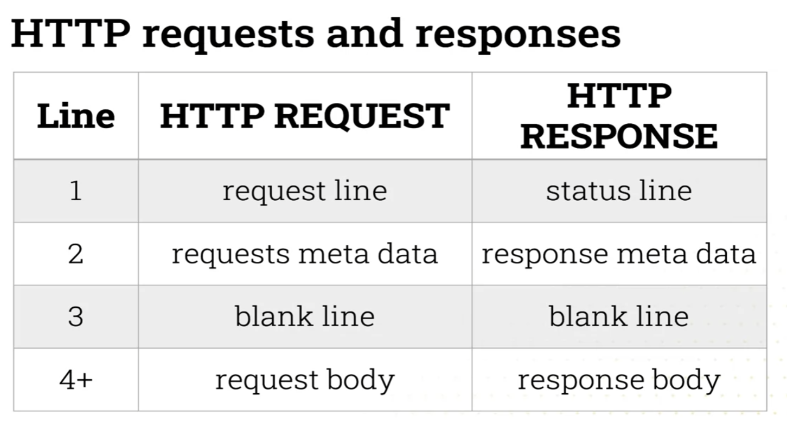

# Advanced Web Development
Lecturer: Dr Daniel Buchan

## Notes
**Assessment:**
- 50% midterm project - web server
- 50% final project - social network

Packages to use for development that will work well together:
- Python 3.11
- `pip install Django==4.2`
- `pip install psycopg2==2.9.9` (`psycopg2-binary==2.9.9` instead?)

To run Django project in Coursera lab this needs to be set in `settings.py`:
```py
ALLOWED_HOSTS = ['.coursera-apps.org',]
```

**Resources:**
- [REST API Crash Course](https://youtu.be/qbLc5a9jdXo?si=qg2pRchVfMW6wgjq)

## Week 1
Create a Python virtual environment
```bash
python -m venv env_name # typically env or venv
```

Working with environments
```bash
# command prompt
env_name\Scripts\activate.bat
# bash
source env_name/Scripts/activate
# PowerShell
env_name/Scripts/Activate.ps1

# install a package
pip install Django==3.0.3

# save the requirements to a text file so they can be installed later
pip freeze > requirements.txt

# to exit environment
deactivate

# install requirements from a file
pip install -r requirements.txt
```

For convenience, virtual environments can be managed using [virtualenvwrapper](https://virtualenvwrapper.readthedocs.io/en/latest/). It stores all the virtual environment files in one place in `~/.virtualenvs` and provided two main commands:
```bash
# create a virtual env
mkvirtualenv env_name

# switch to a virtual env
workon env_name

# exit environment
deactivate
```

### Internet Protocol Suite - TCP/IP
**TCP/IP** is an *umbrella term* for a suite (multitude) of protocols that allow for communication on the web. The two main protocols are:
- *TCP (transmission control protocol)* provides the means of delivering error checked streams of bytes between Internet Protocol connected computers.
- *IP (internet protocol)* governs how to relay and route packets of data across computers on connected networks.

The suite is composed of multiple layers:
| Layer           | Protocols                     | Role |
|-----------------|-------------------------------|-|
| Application     | **HTTP**, HTTPS, FTP, SMTP    | Interfaces with software like web browsers or email clients |
| Transport       | **TCP**, UDP                  | Manages host-to-host communication |
| Internet        | **IP**, ICMP                  | Handles routing across multiple networks using IP addresses |
| Link (Network)  | Ethernet, Wi-Fi, etc.         | Handles direct connections on a single network |

When making a request *HTTP* is used to format the request (GET, POST, etc.), *TCP* ensures reliable delivery, *IP* routes the data across networks.

**Port numbers** identify specific applications/services on a host. When making a request, a **port** is sent alongside the IP address, it specifies the destination application or service running on the host computer.

Common ports:
- `20` and `21`: FTP data and FTP control
- `22`: Remote login secure shell (SSH)
- `53`: Domain Name Resolution (DNS)
- `80`: HyperText Transfer Protocol (HTTP)
- `143`: E-mail Internet Message Access Protocol (IMAP)
- `443`: Secure Hypertext Transfer Protocol (HTTP)
- `666`: DOOM multiplayer 😈

Port values range from `0-65535`. Numbers between `0-1023` are reserved for common applications. Development servers often use ports `4000`, `8000`, `8080`.

**HTTP** is a stateless request-response protocol. Client applications (user agents) request data and server applications send data.

By stateless we mean that the server doesn't remember anything about the client between requests. Extra mechanisms like cookies or sessions are used to identify and keep track of a client.

|  |  |
|-|-|

**MVC**
- *Model* - store, generate, retrieve data
- *View* - controls how to build the user interface
- *Controller* - application logic, connects the user to the model and views

### Django basics

```bash
# create a new Django project
django-admin startproject simplesite

# create a new application in a project
python manage.py startapp helloworld

# start the server
python manage.py runserver
```

A Django project can have multiple apps, each responsible for a different part of the functionality. After creating a new app it needs to be included in `settings.py > INSTALLED_APPS` and we should map it to an url in `urls.py > urlpatterns`, ex:

```py
urlpatterns = [
    path('', include('helloworld.urls')),
    path('admin/', admin.site.urls),
]
```

In the app itself an url can map to a view, `path('', views.index, name='index')`, and the request is handled in the view code:
```py
from django.shortcuts import HttpResponse

def index(request):
    # this view returns a simple string
    return HttpResponse('This is the index page')
```

Views can also render **HTML templates** which are placed in the `/templates` directory of an app. Inside a template view data can be accessed: `<p>{{ data.text }}</p>` and it's also possible to combine templates using blocks:

```html
<head>
    <title>Dummy title</title>
</head>
```

```html

Hello world!
```

To render a template for a view we use the `render` method:
```py
def about(request):
    return render(request, 'about.html')
```

Other types of template tags:
- `...`
- `......`

### Data in Django

Django uses an Object Relational Mapping (ORM) to handle data. The database is created and updated according to the structure defined in code. Classes in `models.py` map to tables in the DB.

```py
from django.db import models

# each class maps to a table
class Hello(models.Model):
  # class variables map to fields
  text = models.CharField(max_length=200)
```

To make things easier the DB can be managed through the admin interface, this can be done by referencing the model in `admin.py`, ex: `admin.site.register(Hello)`.

A super user is needed to access the admin panel

```bash
python manage.py createsuperuser
```

After changing the DB model the actual DB needs to be updated by running a migration:

```bash
# create a migration file
python manage.py makemigrations
# apply the migration to the DB
python manage.py migrate
```

Data can also be added from a JSON file
```json
// initial.json
[{
    "model": "helloworld.Hello",
    "pk": 1,
    "fields": {"text": "HELLO WORLD!"}
}]
```
```bash
python manage.py loaddata initial.json
```

## Week 2

More about views:
- It's possible to set the response type and status code in the view: `return HttpResponse(html, content_type='text/html', status=200)`
- Inside view logic, `request`
    1. is an object
    2. `request.META` is a dictionary
    3. `request.META['REMOTE_ADDR']` is the requesting client's IP

### Django models
```py
# every model has a primary key, pk, that is defined automatically and auto-incremented
class Person(models.Model):
    # model is indexed by the "name" field which optimizes searching for persons by name, this is not pk
    name = models.CharField(max_length=500, null=False, blank=False, db_index=True)
    age = models.IntegerField(null=False, blank=True)

    # override what is returned when a Person is cast to string
    def __str__(self):
        return self.name

class Address(models.Model):
    number = models.IntegerField(null=False, blank=True)
    street_name = models.CharField(max_length=500, null=False, blank=True)
    # models can be linked together through foreign keys
    resident = models.ForeignKey(Person, null=True, on_delete=models.SET_NULL)
```

### Django URLs
URL dispatching can be done in different ways:
```py
# static dispatch
path('user', helloworld.return_all)
# an integer with the name `id` will be sent to the view fn
path('user/int:id', helloworld.id_lookup)
# a string with the name `name` will be sent to the view fn
path('user/str:name', helloworld.name_lookup)
```
Regular expressions can be used for more complex matching and Django has its own 
syntax for capturing variables from a RE string:
```py
# static dispatch
re_path('^user$', helloworld.return_all)
re_path('^user/(?P<id>\d+)$', helloworld.id_lookup)
re_path('^user/(?P<name>\w+)$', helloworld.name_lookup)
```

### Django lightweight

Despite the large number of files included in the starter project, it's actually possible to create a single file lightweight Django server. All you'd need to define is: a route to a view function, the view function, a minimal set of settings, a way to start the server from the command line.

## Week 3

Topics: relational model, relational databases, tables (relations), data types, columns (attributes, features), rows (tuples, entities)

`C:\'Program Files'\PostgreSQL\16\bin\psql.exe -h localhost -U postgres -d postgres -p 5432`

```sql
CREATE DATABASE example;

-- connect to a database
\c example

-- shows all databases
\list

CREATE TABLE people(
    pk SERIAL PRIMARY KEY, name VARCHAR(255) NOT NULL,
    name VARCHAR(255) 
    height_cm INT, 
    gender VARCHAR(255), 
    date_of_birth DATE
);

CREATE TABLE address(
    pk SERIAL PRIMARY KEY, 
    house_number INT, 
    street_name VARCHAR(255), 
    city VARCHAR(255), 
    country VARCHAR(255)
);

-- shows all tables in database
\d
\d people

-- clears console
\! clear

ALTER TABLE address ADD people_pk INT;
ALTER TABLE address ADD FOREIGN KEY (people_pk) REFERENCES people(pk);

ALTER TABLE people ADD address_pk INT;
ALTER TABLE people ADD FOREIGN KEY (address_pk) REFERENCES address(pk);

INSERT INTO People(name, height_cm, gender, date_of_birth) VALUES
    ('BEN', 167, 'Male', '1978-03-14');
```

`SERIAL` - an integer that is auto incremented.

### Normalisation
#### First normal form
The data is indexed with an unique primary key, there are no repeating unit groups and the data is atomic.

#### Second normal form
Remove duplicates that depend of aggregates including the primary key.

#### Third normal form
There are no transitive dependencies between the data.

### Query performance

```sql
-- queries that search on the entity column will be faster
CREATE INDEX entity_index ON genes(entity);
```

A **materialized view** is a database object that contains the results of a query. In PostgreSQL the view doesn't automatically change its contents when one of the tables it references changes. The refresh can be triggered with the `REFRESH MATERIALIZED VIEW <view_name>` command.

```sql
CREATE MATERIALIZED VIEW gene_ec_view AS
    SELECT gene_id, entity, source, start, stop, sequencing_pk, ec_name
    FROM genes, ec
    WHERE genes.ec_pk = ec.pk;
```

### Querying

Aggregate functions: 
- Numerical: `COUNT`, `MIN`, `MAX`, `AVG`, `ROUND`, 
- String: `UPPER`, `LOWER`, `LENGTH`
- Date: `NOW`

```sql
-- aggregate functions can be combined
SELECT ROUND(AVG(start)) FROM genes;
```

## Week 4 - Object Relational Modelling
Django simplifies the day the code interacts with the database by having objects (classes) which correspond to relations in a database. Instead of writing SQL commands as strings we can simply query the corresponding objects and the result is given in a usable format.

```py
# classic, non-ORM way of interacting with a database
query = 'SELECT name, age FROM users WHERE uid=15'
result = database_handle.send_sql(query)
data_array = ParseToArray(result)
this_user = new User(data_array)
Name = this_user['name']

# interacting with DB through ORM
result = User.get_by_id(object_id)
name = result.name
```

### Models
Classes that inherit from `Model` (models) map to database tables and class variables map to table columns.
By convention, singular names are used for the classes. By default Django adds the primary key automatically in a column called `id`.

```py
from django.db import models

class Gene(models.Model):
    gene_id = models.CharField(max_length=255, null=False, blank=False)
    entity = models.CharField(max_length=255, null=False, blank=False)
    start = models.IntegerField(null=False, blank=True)
    stop = models.IntegerField(null=False, blank=True)
    sense = models.CharField(max_length=1)
    start_condon = models.CharField(max_length=1, default="M")
    # foreign keys, by convention named the same as the target table but in lowercase
    # they require an `on_delete` activity to be specified
    sequencing = models.ForeignKey(Sequencing, on_delete=models.DO_NOTHING)
    ec = models.ForeignKey(EC, on_delete=models.DO_NOTHING)

    # override method for getting a row as a string
    def __str__(self):
        return self.gene_id
```

Data models allow the implementation to be decoupled from the database engine making it easy to swap between them, ex: SQLite for local development and then MySQL or PostgreSQL for production.

```bash
pip install psycopg2
```

```py
DATABASES = {
    'default': {
        'ENGINE': 'django.db.backends.postgresql_psycopg2',
        'NAME': 'bioweb_db',
        'USER': 'postgres',
        'PASSWORD': 'admin',
        'HOST': 'localhost',
        'PORT': '5432',
    }
}
```

```bash
# show migrations that are ready to be applied
python manage.py showmigrations
# create migrations for changes made to models (makes files but doesn't apply the migrations)
python manage.py makemigrations
# show the SQL commands that will be run by the migration
python manage.py sqlmigrate genedata 0001_initial
# run the migrations
python manage.py migrate
```

```sql
-- ran migrations are logged to the database too
SELECT * FROM django_migrations WHERE app='genedata';
```

### Adding data to the database
```bash
# create admin account
python manage.py createsuperuser
# start server
python manage.py runserver 127.0.0.1:8080
# go to admin panel
open http://localhost:8080/admin/
```

In order for models to show up in the admin panel, they need to be registered in `admin.py`.

```py
from django.contrib import admin
from .models import *

# an inline selector for many to many relations
class GeneAttributeLinkInline(admin.TabularInline):
    model = GeneAttributeLink
    extra = 3 # will show 3 boxes

# specify which fields are editable through admin interface
class GeneAdmin(admin.ModelAdmin):
    list_display = ('gene_id', 'entity', 'start', 'stop', 'sense')
    # enable inline selector
    inlines = [GeneAttributeLinkInline]

admin.site.register(Gene, GeneAdmin)
# register just the model using default admin class
admin.site.register(Attribute)
```

### Views
QuerySet API

```py
# function to respond to requests
def index(request):
    # SELECT *
    genes = Gene.objects.all()
    return render(request, 'index.html', {'genes': genes})

def gene(request, pk):
    # get one row
    gene = Gene.objects.get(pk=pk)
    return render(request, 'gene.html', {'gene': gene})

def list(request, type):
    # get all rows that match the condition
    genes = Gene.objects.filter(entity__exact=type)
    return render(request, 'list.html', {'genes': genes, 'type': type})
```

## Week 5
### Templating
Variables that are sent as a dictionary, ex: ` {'first_name': 'John', 'last_name': 'Doe'}`, can be rendered in a template:
```html
<p>My first name is {{ first_name }}. My last name is {{ last_name }}.</p>
```

We can define a base template with elements that are common to multiple pages:
```html
<!-- base.html -->
<!-- pull in content from another html template -->

<div class="content">
    <!-- placeholder to be filled with content -->
    Did not render content
</div>

```

Other templates can the implement that base template:
```html
<!-- index.html -->

<!-- what to place in the content block -->

    <p>This is the content of the page</p>

```

Other types of tags:
- loops: `...gene...`
- conditions: `.........`
- variables: `...seq...`

It's possible to define custom template tags. Create a new folder in the app, ex: `templatetags`, add an `__init__.py` file and implement the tags in another file, ex: `my_tags.py`.

```py
import datetime
from django import template

register = template.Library()

@register.simple_tag
def todays_date():
    return datetime.datetime.now().strftime("%d %b, %Y")
```

This can be called in a template:
```html
<!-- make sure template is aware of custom tags -->

<p></p>
```

### CSS
Static assets can be placed in a `/static` folder inside the app and the referenced from the templates, ex: `<link rel="stylesheet" href="/static/css/genedata.css">`.

Note: When referencing static elements their path is relative to the server root and not to the location of the template files.

CSS specificity:
ID rules > Class Rules > Element Rules

### JavaScript


Note: To use server data inside JavaScript, it's recommended to output this data through the [`json_script` filter](https://docs.djangoproject.com/en/5.0/ref/templates/builtins/#json-script).

### Bootstrap
```bash
pip install django-bootstrap
```
`bootstrap4` needs to be added to `INSTALLED_APPS` then the Bootstrap components can be loaded and referenced inside templates:

```html

<head>
    
    
</head>
<body>
    <div class="navbar navbar-expand-md sticky-top flex-column">
        <!-- ... -->
    </div>
</body>
```

## Week 6 - Forms

```py
# define form
from django import forms

class ECForm(forms.Form):
    ec_name = forms.CharField(label="EC Name", max_length=100)

# use form in view
def create_ec(request):
    if request.method == 'POST':
        form = ECForm(request.POST)
        if form.is_valid():
            # create a new row
            ec = EC()
            ec.ec_name = form.cleaned_data['ec_name']
            ec.save()
            return HttpResponseRedirect('/create_ec/')
    else:
        ecs = EC.objects.all()
        form = ECForm()
        return render(request, 'genedata/ec.html', {'form': form, 'ecs': ecs})
```

To render the form inside the template you need to include a `csrf_token` and output the form variable:
```html
<form action="/create_ec/" method="post">
     <!-- security token -->
    {{ form }}
    <input type="submit" value="Submit" />
</form>
```

To render the form with bootstrap: ``.

`ModelForm`s allow the forms to be specified directly based the model.

```py
# define form
from django.forms import ModelForm
from .models import *

class GeneForm(ModelForm):
    class Meta:
        model = Gene
        fields = ['gene_id', 'entity', 'start', 'stop', 'sense', 'start_codon', 'sequencing', 'ec']

# use form in view
def create_gene(request):
    genes = Gene.objects.all()
    if request.method == 'POST':
        form = GeneForm(request.POST)
    else:
        form = GeneForm()
    return render(request, 'genedata/create_gene.html', {'form': form, 'genes': genes})
```

### Form validation
By default `form.is_valid()` checks that the data matches the model definitions. For more complex validation we can write our own checks:

```py
class ECForm(forms.Form):
    ec_name = forms.CharField(label="EC Name", max_length=100)
    
    def clean(self):
        cleaned_data = super(ECForm, self).clean()
        ec_name = cleaned_data.get("ec_name")
        if not ec_name.isalnum():
            raise forms.ValidationError(
                "EC must be alphanumeric. Invalid value: %(value)s", 
                params={'value': ec_name}
            )
```

### Generic views
Generic views offer a quick way of displaying data in a model with very little code needing to be written.

```py
# in views.py
from django.views.generic import ListView

class GeneList(ListView):
    model = Gene
    # only needed if the name differs from the default (eg. genes)
    context_object_name = 'master_genes' 
    template_name = 'genedata/index.html'

# in urls.py
path('', views.GeneList.as_view(), name='index'),
```

**Types of generic views:**
- `ListView` - shows a list of objects
- `DetailView` - shows a single object
- `CreateView` - allows data to be inserted, needs `form_class` and `success_url` to be set
- `DeleteView` - delete data, needs `success_url` to be set and a corresponding delete confirmation template to be implemented, ex: `author_confirm_delete.html` for deleting objects from the `Author` model.
- `UpdateView` - updates data, must specify `fields` list and an update template must be implemented.

If more data needs to be sent to the template, we can extend the context object:
```py
def get_context_data(self, **kwargs):
    context = super().get_context_data(**kwargs)
    context['master_genes'] = Gene.objects.all()
    return context
```

## Week 7 - RESTful APIs
### CRUD operations


### Representational State Transfer (REST)
REST is a design pattern and software architecture for building scalable web servers and web applications.

An user agent should be able to navigate through the resource or web application using standard HTTP operations (PUT, GET, etc).

**Features:**
1. Client-server architecture
2. Statelessness 
    - same response for the same request
3. Cacheable
4. Layered System 
    - server side implementation details should not need to be known by the client
5. Uniform Interface 
    - URIs identify resources
    - HTTP responses specify how clients handle the data typically by defining media types.
    - HTTP responses provide hyperlinks needed for the client to navigate further through the app
6. Code-on-demand (optional)


### REST in Django

> Django REST framework docs: https://www.django-rest-framework.org/

**Setup:**
```bash
pip install djangorestframework
```
```py
# settings.py
INSTALLED_APPS = [
    'rest_framework',
]
# allow any users to access the REST API
REST_FRAMEWORK = {
    'DEFAULT_PERMISSION_CLASSES': [
        'rest_framework_permissions.AllowAny',
    ]
}
```

A serializer takes data from a model and outputs it in a format that the user can see. It also works in reverse, checking user data against a model. We can define it explicitly by listing all the model attributes and constraints:

```py
from rest_framework import serializers
from .models import *

class GeneSerializer(serializers.Serializer):
    gene_id = serializers.CharField(required=True, allow_blank=False, max_length=256)
    start = serializers.IntegerField()
```

It's also possible to use `ModelSerializer`s to reuse the data definition already set by the model:

```py
class GeneSerializer(serializers.ModelSerializer):
    class Meta:
        model = Gene
        fields = ['gene_id', 'entity', 'start', 'stop', 'sense', 'start_codon']
```

Then to implement a GET API endpoint:
```py
from django.http import HttpResponse, JsonResponse
from django.views.decorators.csrf import csrf_exempt
from rest_framework.parsers import JSONParser
from .models import *
from .serializers import *

@csrf_exempt
def gene_detail(request, pk):
    try:
        gene = Gene.objects.get(pk=pk)
    except Gene.DoesNotExist:
        return HttpResponse(status=404)
    if request.method == 'GET':
        # serialize model row to JSON
        serializer = GeneSerializer(gene)
        return JsonResponse(serializer.data)
```
And add it to `urls.py`: `path('api/gene/<int:pk>', api.gene_detail),`.


We can use generic view classes for API endpoint:
```py
# api.py
from rest_framework import generics
from rest_framework import mixins

class GeneList(generics.ListAPIView):
    queryset = Gene.objects.all()
    serializer_class = GeneSerializer

# urls.py
urlpatterns = [
    path('api/gene/', api.GeneList.as_view()),
]
```

Mixins can be used to specify which operations are supported by an endpoint.

```py
class GeneDetails(mixins.CreateModelMixin, 
                  mixins.RetrieveModelMixin,
                  generics.GenericAPIView):
    queryset = Gene.objects.all()
    serializer_class = GeneSerializer

    def post(self, request, *args, **kwargs):
        return self.create(request, *args, **kwargs)
    def get(self, request, *args, **kwargs):
        return self.retrieve(request, *args, **kwargs)
```

## Week 8 - Testing

```bash
pip install factory_boy
```

The data generated by a factory can be randomized in order to prevent a scenario in which the tests pass for hardcoded values but fail in other scenarios.
```py
# model_factories.py
import factory
from random import randint, choice

class GeneFactory(factory.django.DjangoModelFactory):
    # gene_id will be: gene1, gene2, ...
    gene_id = factory.Sequence[lambda n: 'gene%d' % n+str(1)]
    # description will be a random word
    description = factory.Faker('sentence', nb_words=1)
    # entity will be one of 2 values
    entity = choice(['Plasmid', 'Chromosome'])
    start = randint(1, 1000)
```

When running tests, the default behavior is to find all the test cases (subclasses of `untittest.TestCase`) in any file whose name begins with *"test"*.

```bash
python manage.py test
```

To test DRF API routes and Serializers, the test suite will be a subclass of `APITestCase`.

## Week 9 - AJAX

**Asynchronous Javascript And XML (AJAX)** is a way to build dynamic web applications where the client-side JavaScript code queries the server in order to retrieve data asynchronously. The user interface is built on the client-side using this data, allowing for more dynamic interactions. 

> AJAX decouples the data interchange layer from the presentation layer, allowing applications to change content dynamically without the need to reload the page.

Nowadays, JSON is generally used instead of XML as the data format. JSON is easier to read by humans and is easily serializable/deserializable.


Disadvantages of AJAX:
- Not great for search engines, there isn't a web of interlinked pages, only a single ever-changing page
- Reliance on JavaScript to display the app, app won't run if JS is disabled or not supported by the browser
- Less accessible for screen readers and other non-ui based clients

```js
const request = new XMLHttpRequest();
// Prepare a GET request on api/message endpoint, make it async
request.open('GET', '/api/message', true);
// Attach an event listener function
request.onreadystatechange = function () {
    if (this.readyState == 4 && this.status >= 200 && this.status < 400) {
        var data = JSON.parse(this.responseText);
    }
    else {
        console.log("Request failed: " + this.statusText);
    }
};
// Initiate the request
request.send();
```

## Week 11
### Synchronous vs asynchronous web services
**Synchronous design** is a design pattern in which the sequencing of events happens in series. The message sender waits for a response before continuing.

When interacting with a synchronous web server, the client has to wait for the server to issue a response before it can issue new instructions.

**Asynchronous design** allows the client and server to execute code in parallel through non-blocking code execution.

**Client-side asynchrony** is a pattern in which the client issues async requests via AJAX and callbacks or promises for requests. The server can remain synchronous. This is typically used when the client queries a data source.

**Server-side asynchrony** is useful for long-running computations while ensuring the app remains responsive. Ex: sending batch emails, processing files. The client polls the server to check if the calculation has been completed.

**Web sockets** provide an ongoing channel for bi-directional communication between client and server.

### Task queues
Task queues offload computation to a parallel system. Series of "workers" monitor a queue for units of work/computation. This enables async computation and gives good separation of concerns: web server, queue broker, workers.

> Task queues are used as a mechanism to distribute work across threads or machines.

> A task queue's input is a unit of work called a task. Dedicated worker processes constantly monitor task queues for new work to perform.

Queues/Brokers:
- RabbitMQ - open source message broker, many messaging protocols
- Redis - open source, in-memory key-value data store, cache or message broker

Queue frameworks: [Celery](https://docs.celeryq.dev/en/stable/getting-started/introduction.html#get-started), Dramatiq, Sidekiq, RQ, Delayed_job, RabbitMQ, AnyMQ

**Celery** is a task queue. Clients submit units of work to a queue broker, workers watch the broker and complete the work as it appears. Multiple queues and multiple workers can be used. Celery integrates easily with Django.

Celery requires a solution to send and receive messages; usually this comes in the form of a separate service called a **message broker**.

**Workers** are daemonised python threads. They take units of work from the queue and run some Python function.

**Daemon** - a piece of software that runs as a background process, rather than being under the direct control of an interactive user.

```bash
# install Celery and the packages it needs to connect to Redis
pip install celery[redis]

# install Redis
pip install redis
```

Note: Follow this tutorial to [install Redis](https://redis.io/blog/redis-on-windows-10/) on Windows 10. Then run `sudo service redis-server start` and `redis-server` and leave the terminal running.


```py
# simple_task.py - run the celery queue
from celery import Celery
import time
import random

# parameters: package name, queue location, location for results
app = Celery('simple_task', broker='redis://localhost/', backend='redis://localhost/')

# define a task
@app.task
def wait():
    wait_time = random.random() * 5
    time.sleep(wait_time)
    return "I waited for "+str(wait_time)+" seconds"
```


```bash
# run celery, simple_task package, start workers and set a log level
celery -A simple_task worker --loglevel=INFO -P threads
```

Note: On Windows the tasks will hang if you don't set `-P threads`, [link](https://stackoverflow.com/q/27357732/1333383).

```python
# add tasks to the queue and get the results
from simple_task import wait, greater_than

result = wait.delay()
print("state", result.state)
print("value", result.get()) # wait for result

result2 = greater_than.delay(4, 5)
print("state", result2.state)
print("value", result2.get())
```

### Celery and Django

```bash
# install image manipulation package
pip install Pillow
```

```bash
celery --app=image_store.celery:app worker --loglevel=INFO --pidfile=celery.pid -P threads
```

## Week 12
**Web sockets** came about because of the need to standardize engineering practice in real-time web communication. Before, it was difficult to make the server initiate communication with a client, as the HTTP model was primarily based around the client initiating requests and waiting for a responses.

**Short polling** is the technique of the client requesting updates from the server at a given interval, to check if a resource has changed. It has many disadvantages: how often to poll, redundant requests, additional server load.

The **Comet** model is a workaround in which an HTTP connection is kept open for a long time which allows the server to push data to the browser, without the browser explicitly requesting it. When a response is received, the client immediately sends a new request (**long polling**). 

**HTTP Streaming** exploits a quirk of HTTP servers. The server responds to a request before the whole request is sent. The client holds off sending the terminating part of the request. By not terminating the request, ongoing two way communication is possible.

Both long polling and streaming repurpose tools that were not designed for purpose and make it difficult to manage connections.

### WebSockets
WebSockets is a 'thin' protocol over TCP/IP without it being wrapped in a HTTP message. It provides details for establishing a connection and agreeing how the data should be encapsulated.

| Client initiates connection with handshake | Servers confirms the connection |
|-|-|
|  |  |

```js
var socket = new WebSocket("wss://www.example.com/", "json");
socket.send("Some example data");

socket.onmessage = function (event) {
    console.log(event.data);
}
```
#### Messaging
- Data packaged into 'frames', large messages can be split over frames
- Opcodes used to define the message start and stop
    - `ping` and `pong` codes can be used by client or server to check the connection is still open
- Data is masked with XOR 32-bit encryption

#### Issues
- Lack of true streaming
- No message acknowledgement functionality
- No limit on number of connections a client can open
- Connection duration is not defined

### Django channels
Channels are Django's implementation of the WebSockets protocol. They replace the core of routing, views and serving internals.

Channels are subscribable streams of data. HTTP handling is implemented as a pre-made channel.

*Scope*: the details that define a connection and a request to join a channel

*Events*: the stream of user interactions for the channel that get sent to every attached client


*Consumers* are pieces of code that consume events (similar to views). Channel requests are routed to the appropriate consumer. A client connected to a consumer will receive all events on that channel. Channel support http, WebSockets and other protocols.

```bash
pip install channels[daphne]
pip install channels-redis 
```

## Week 13

APIs are code interfaces. They define how components of a software system communicate and provide abstraction to the underlying code. 

Example of APIs:
- Object Oriented class specification
- Operating System/kernel interface
- Remote/Web APIs

**Common Gateway Interface (CGI)** scripts were an early method for clients to request code execution on the server. Typically written in C, form data would be passed to the script and the script was executed in a separate process. The result is returned to the user.


**Spiders** are pieces of code that can read pages, follow links and gather data. They can be used to extract the data from a page/site and return it as a dataset.

For dynamic websites where the content changes after submitting a form (ex: search), another technique was used, called "form hacking" or "screen scraping".

<figure>
    
    <figcaption>API standards</figcaption>
</figure>

### Accessing APIs with JavaScript

1. Using `XMLHttpRequest`
1. Using jQuery's `$.ajax`
1. Using WebSockets
1. Using the `fetch` API

```js
async function getData() {
    let response = await fetch("http://example.com");
    let data = await response.json();
    
    return data;
}

getData().then(() => { /* ... */ });
```


APIs can also be queried through the terminal on UNIX systems:
```bash
# will save the response to a file
wget www.google.com
# recursive, will pull in page and linked pages
wget -r www.google.com

# different way to do the same thing, saves response to a file
curl www.google.com > index.html
# passing parameters as an argument
curl -d 'db=taxonomy&id=9606' www.google.com
```

## Week 14

