# Introduction to programming

## Week 1
### Learning Objectives

1. Set up the programming tool kit and use it to edit and run programs.
1. Use built-in drawing functions and 2D coordinates to draw simple shapes on the screen.
1. Describe the process of writing code.

### Thoughts

A novel approach to teaching programming that starts out with simple but very visual exercises, focuses on commands for drawing geometric shapes on the screen and gradually moves to more advanced complex like arrays, functions, classes, etc.

This is in stark contrast to my learning in highschool or college where it took ages to get anything interesting to show up on the screen, for many months you were stuck with the barren terminal output. It explains a why web development is the only thing that got me really interested in programming. The feedback-loop of writing code and seeing it do something on the screen is very powerful and I'm glad teachers have become aware of its potential as a learning tool.

The first week's course was focused on setting up the development environment, learning the basics of p5.js and using it to draw simple shapes on the screen. In one exercise we were given the code that would draw a robot on the screen and were asked to make changes to it. I made a few tweaks but nothing major, others were more ambitious, it inspired me to put more effort into my work in the future.

| What we started with | What I made | What someone else made |
|-|-|-|
| 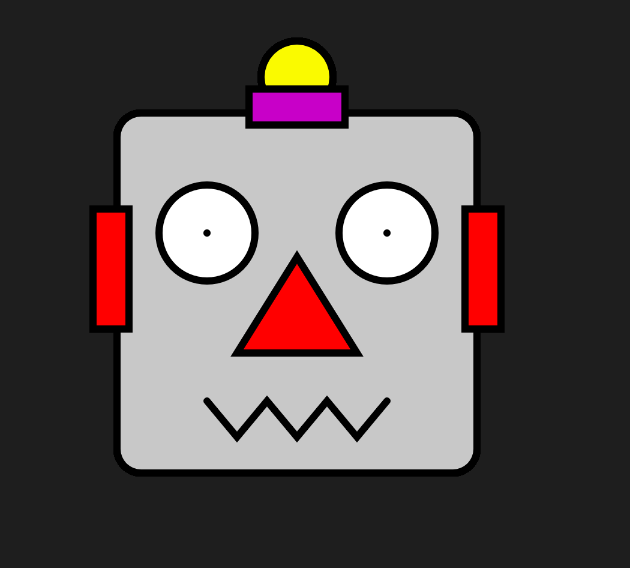 | 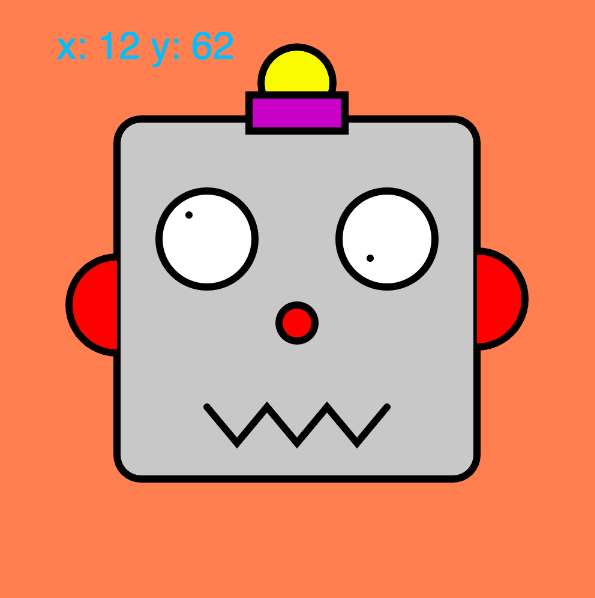 | 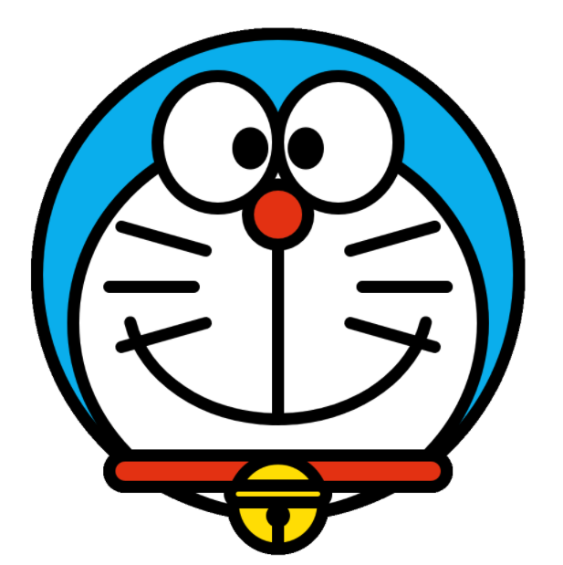 |

> Doraemon drawing made by fellow student "Tsuyoshi Watanabe".

Second drawing exercise asked us to create a drawing inspired by the "De Stijl" movement. The main proponent of this style was Piet Mondrian. I replicated a scene from Scissor Seven, it was very rewarding to see it done.

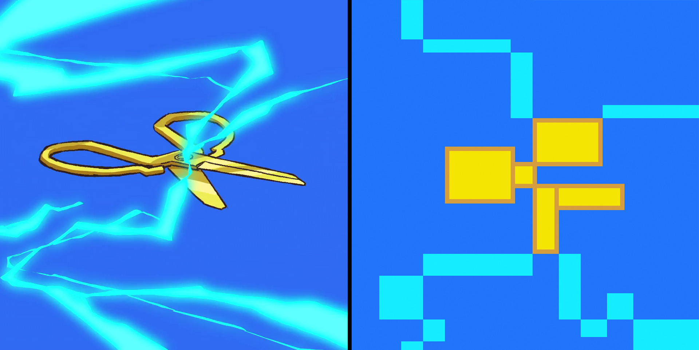

|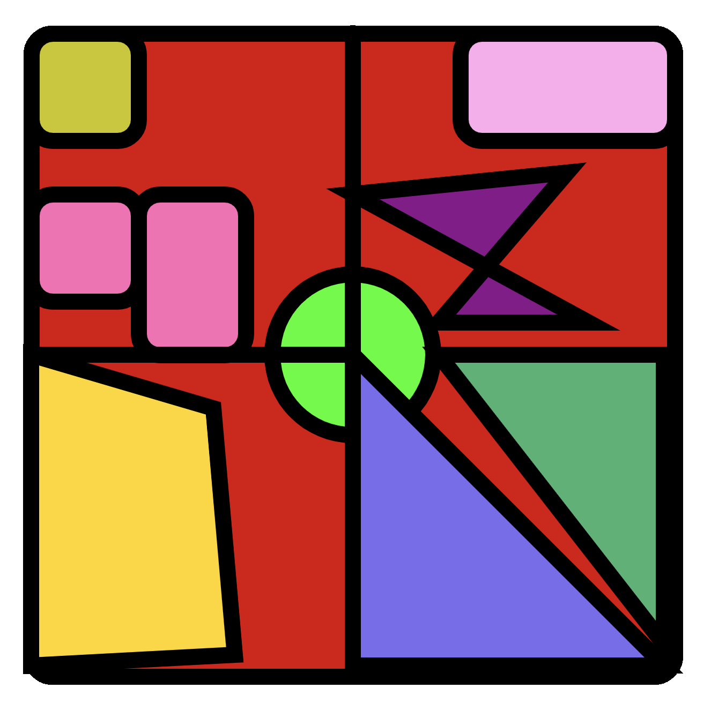|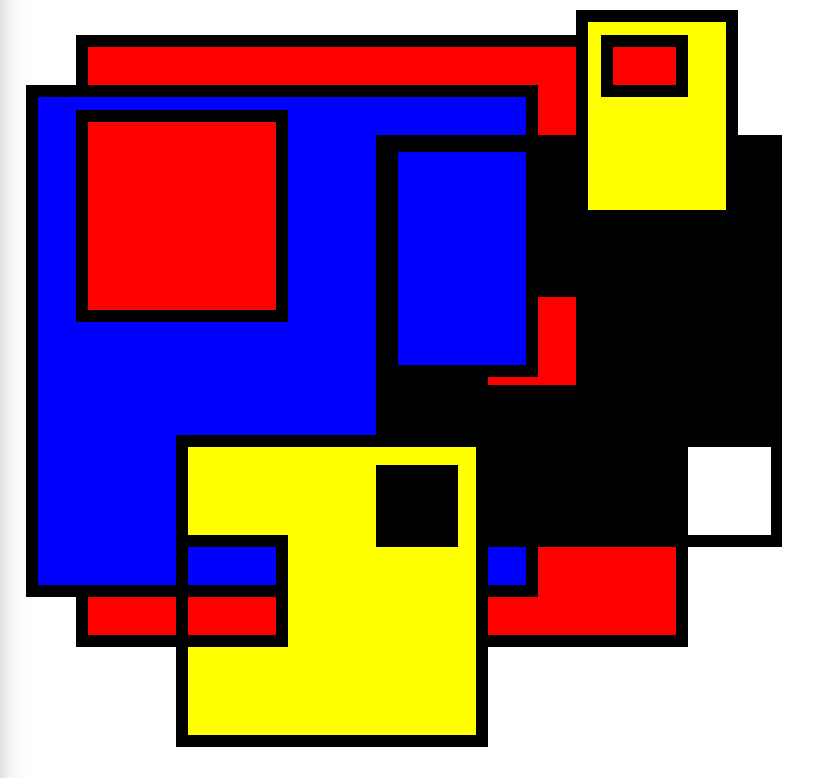 |
|-|-|
|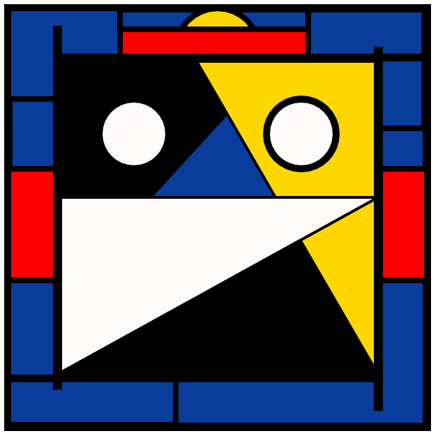|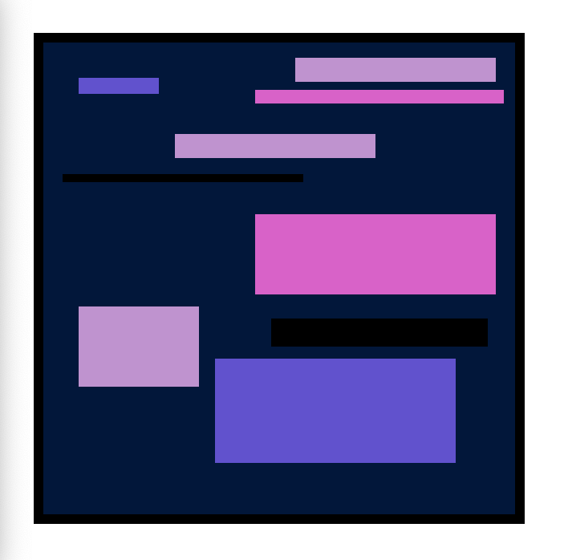|
|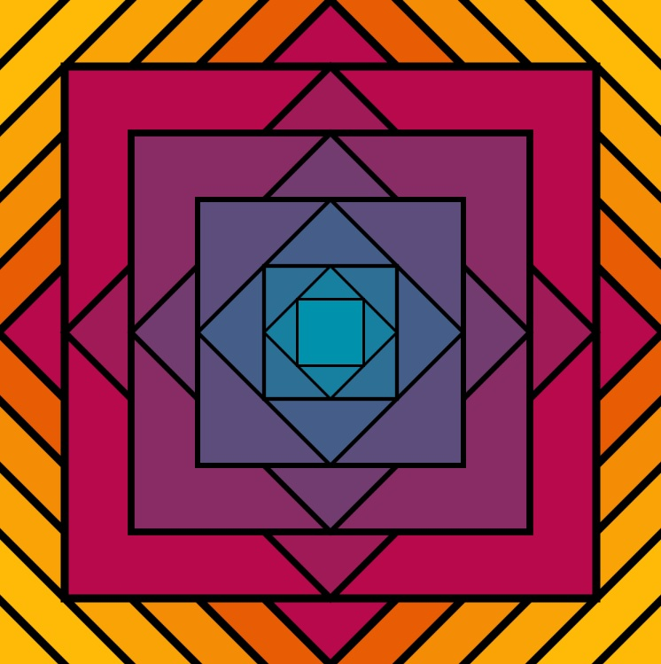||

## Week 2
### Thoughts

Introduction to the Sleuth game. Use p5.js to solve crimes! :D
Explanation of how the course is graded: 
- 50% Solving Cases in Sleuth Game (Rookie + Pro levels)
- 50% Building a game project (two parts, each worth 25%)

List of web colors with RGB values: https://www.rapidtables.com/web/color/html-color-codes.html

## Week 3
### Learning Objectives

Topics covered: `background()`, RGB colors, `fill()`, `noFill()`, `stroke()`, `strokeWeight()`, `noStroke()`, p5 lifecycle (`setup()` and `draw()`), `ellipse()`, `line()`, `triangle()`, `point()`, `beginShape()`, `endShape()`, `vertex()`, debugging.

### Thoughts

We had two drawing exercises. The first one was called *Robot Parade* and I spent hours on but it was worth it as it came out looking rather nice. 
The second one was to create a drawing in the style of Wassily Kandinsky. I chose Gurren Lagann as the theme as Kandinsky's "Blue Painting" reminded me of it.

| Robots | Robots with funny faces | Gurren Lagann |
|-|-|-|
|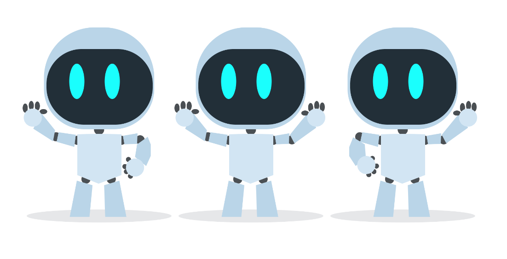|||

> The most rewarding part of this class is seeing the amazing things that my peers create for the drawing exercises. Seeing others put a lot of effort into their creations motivates me to do the same. I get to stretch my creative muscle and I think I'm getting better at drawing along the way.

The second part of this week's learning was centered around debugging: how to access the dev console in a browser and how to interpret common error messages.

Types of errors:
- Syntax error - code cannot be interpreted
- Argument error - invalid type or number of arguments sent to function
- Semantic error - code doesn't produce the expected results

## Week 4
### Learning Objectives

Asking for help, game project pt.1 (background graphics), sleuth cases explained

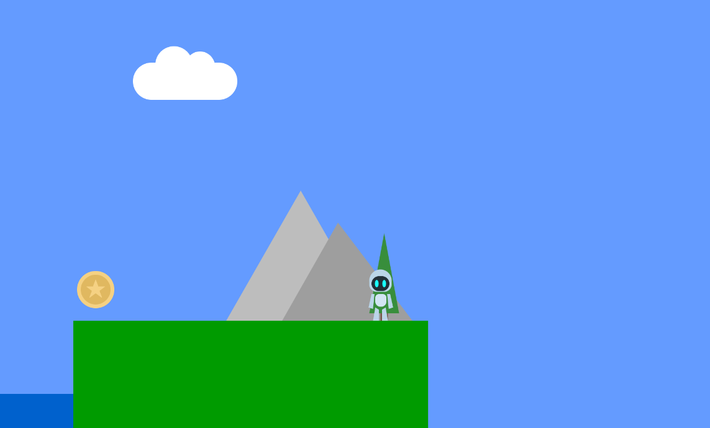

## Week 5
### Learning Objectives

Topics covered: `mouseX`, `mouseY`, `mousePressed()`, `keyPressed()`, drawing app, variable naming, `text()`, variables and objects,
math operators, `min()`, `max()`, `random()`.

## Week 6
### Learning Objectives

- Code philosophy: the elegant coder
- Game project: game character
- Topics covered: variables

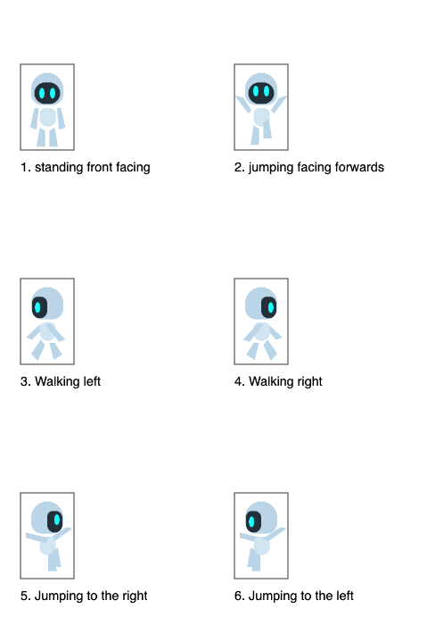

## Week 7
### Learning Objectives

- Conditional statements: `if`, `==`, `!==`, `else`, `elseif`, `&&`, `||`
- Data types in JavaScript, casting
- Debugging: `time spent debugging is never time wasted`, commenting and isolation


## Week 8
### Learning Objectives

- Game project: movement in 2d space

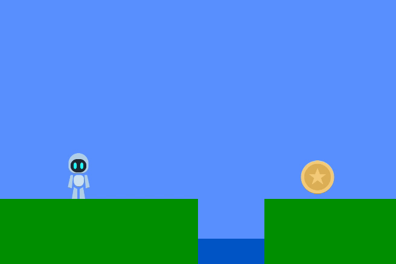

## Week 9
### Learning Objectives

- For loops, Arrays

## Week 10
### Learning Objectives

- Code philosophy: coding workflow - optimize workflow to reduce errors and frustration - "Always code with a good workflow"
- Game project: side scrolling
- 🚨 MIDTERM!!!


### Thoughts

One of the other students created the scene below. You can tell a lot about the player character just from his stance. Also the art style is reminiscent of 90s adventure games made by Lucas Arts. Definitely something to aspire towards in my own efforts.

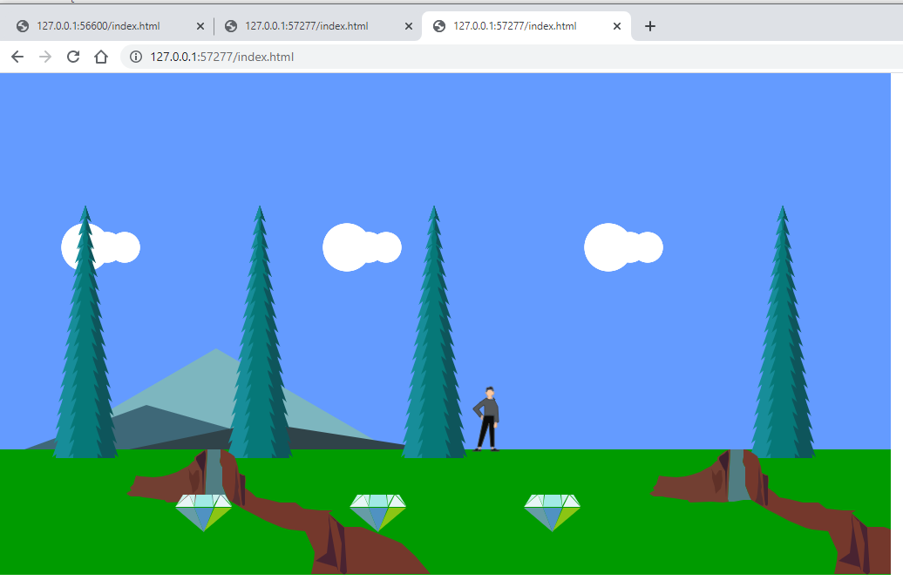

## Week 11
### Learning Objectives

- Iterating through arrays, making arrays of objects, nested iteration, Chrome Dev Tools debugger in Sources tab, `.length` and `.push()`
- Hack it exercise: robots race

- Drawing exercise: Warhol soup


### Thoughts

About Chrome Dev Tools Sources tab:
- We can set a breakpoint inside a for loop, for each of the iterations
- Step over - move on line at a time - cool way to visualize how nested for loops work

## Week 12
### Learning Objectives

- Code philosophy: testing, edge cases, first step in writing software is requirements gathering, dividing code into smaller reusable pieces makes it easier to test, unit testing, user testing
- "When debugging ends, testing begins"
- Game project: putting everything together - movement, scrolling, collectables, character falling to his doom
- First Sleuth Pro Cases

### Thoughts

- Boeing airplanes need 14 mil lines of code to function.
- Sleuth has a temp lock feature because user testing showed that users would get more and more frustrated as they were submitting one invalid solution after the other (brute force mentality). By locking the app and allowing for a cooldown, better results were achieved.

## Week 13
### Learning Objectives

- Functions
    - "allow code to be reused and allow code to be organized into discrete sections"
    - early return
    - function arguments
    - recursion: stop condition, recursive step
    - return value
- Software stack
    - `sketch.js -> p5.js -> WEBGL & JavaScript & HTML Canvas -> ... -> Computer Hardware` 
    - high level programming - writing code at the top of the stack
    - low level programming - writing code at the bottom of the stack
- Debugging
    - breakpoints, step over function call, step into function call
    - call stack - chain of which function called which other function up to the current call
- Variable scope, global variables, local variables
- Copying variables
    - simple types are copied by value: Number, Boolean, String
    - complex types are copied by reference: Array, Object

## Week 14
### Learning Objectives

- Code philosophy: the 'put it off till later' approach
    - coder's block, plan out code before starting, pseudocode, flowcharts
    - write comments describing the implementation, figure out how it should work, then write the code
    - "Putting it off until later might be more productive!"
- Game project: level end, player death and lives, score counter, win screen, lose screen

## Week 15
### Learning Objectives

- 2D arrays, arrays of objects
- `continue` and `break` in loops
- Search patterns: find a value in an array, find min and max, exclude values from an array

## Week 16
### Learning Objectives

- Common errors with data: `undefined`, `NaN`, `undefined + 3 == NaN`
- Code philosophy: iterative coding
    - coding cycle
    - coding vs architecture
    - iteration: naive implementation -> mature implementation
    - "Great code is built with baby steps"

## Week 17
### Learning Objectives

- Functions within objects aka methods
- The `this` keyword
- p5 Vector, `createVector()` ,`.rotate()`, `.mult()`, `.normalize()`
- Static versions of vector methods: `p5.Vector.rotate()`, `p5.Vector.mult()`


JavaScript objects can have both properties and methods. Methods can use the object's properties by referencing them with the `this` keyword.

```js
// an object
var myObj = {
    // properties
    width: 200,
    height: 300,
    // a method that prints the properties
    showDimensions: function() {
        console.log("object width: " + this.width);
        console.log("object height: " + this.height);
    }
};

// calling a method on the object
myObj.showDimensions();
```

### p5.Vector
`rotate()` - Rotates a 2D vector by an angle without changing its magnitude. The rotation happens in relation to the origin of the coordinate space. By default the angle is in *radians* ($360^\circ = 2 \pi$).

```js
// example of how to rotate a point represented as a vector
var myPoint;

function setup() {
    createCanvas(300, 300);
    myPoint = createVector(0, -100);
}

function draw() {
    background(0);
    fill(255);

    // translates the coordinate space to the middle of the screen
    translate(width/2, height/2);

    // draws a point at the vector coordinates
    ellipse(myPoint.x, myPoint.y, 20);

    // update the vector position by applying a small rotation,
    // this will animate the point's position
    myPoint.rotate(0.1);
}
```

`mult()` - multiplies the vector's xyz components by a scalar value.

Note: Static versions of the vector operations are available on the `Vector` class. These don't change the vector directly, instead they return the changed version of the vector. Ex: `newVec = p5.Vector.mult(oldVector, 4)`.

`normalize` - makes the vector a *unit vector*, its *length* will be $1$.

### TODO
- Tamagotchi eye rotation

## Week 18
### Learning Objectives

- Code philosophy: Googling for help
    - separate the generic issue from the unique parts of your implementation
- Game project part 7: make it awesome
    - TODO: come back to this after finishing the course
    - sounds: jump, collectible, die, bg music (loop)

## Week 19
### Learning Objectives

- The Factory Pattern - create an object inside a function and return it
- The `constructor` function and the `new` keyword
- TODO: Particle system
- Factory pattern vs constructor pattern:
    - If the created object has methods, the constructor patern is best

## Week 20
### Learning Objectives

- Game project:
    - Platforms - factory pattern