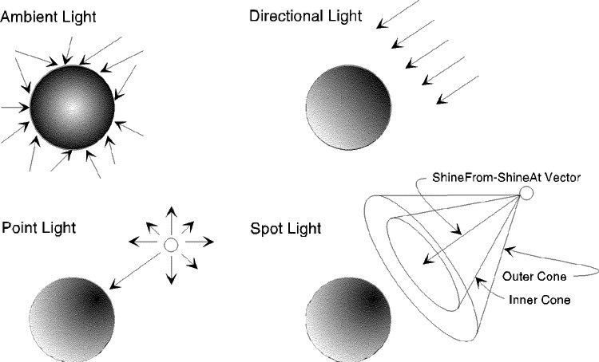
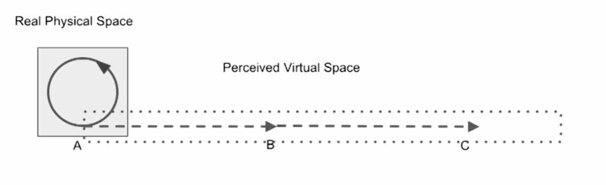
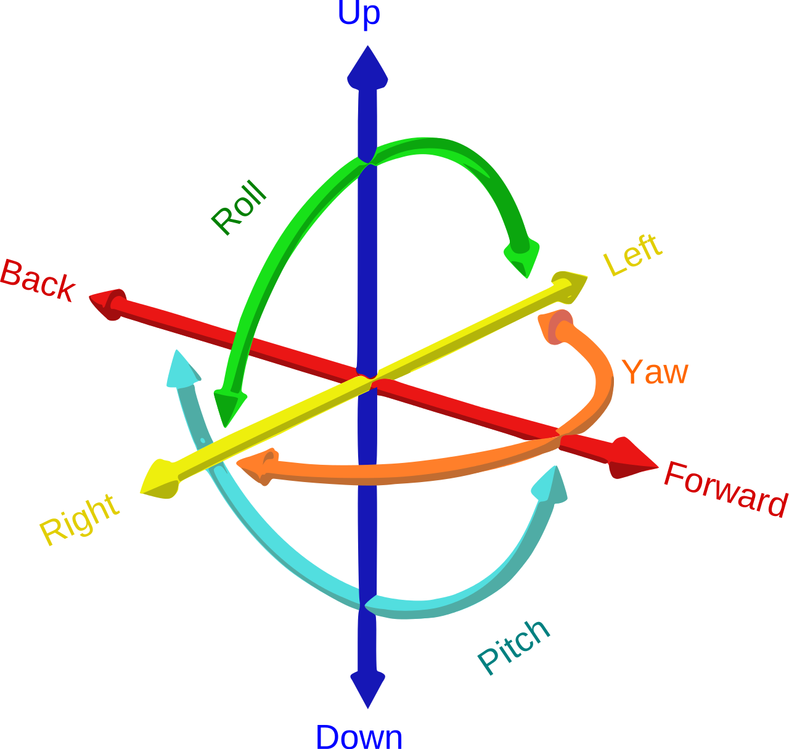
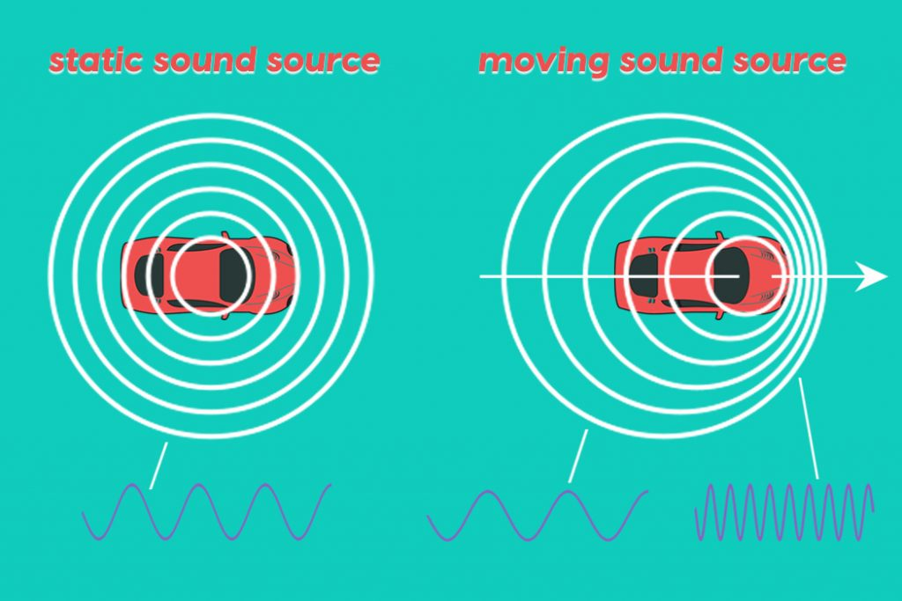
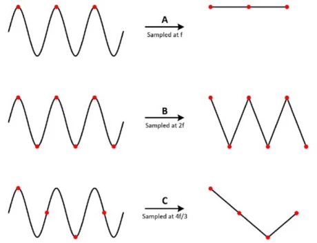

# Virtual Reality

> Lecturer: Dr. M. Gillies, Dr. S. Pan

## Notes

Assessment:
- Midterm 30% - Coursework 1
- Final 70% - Coursework 2

Useful links:
- [How to make a VR game - Unity XR Toolkit 2022](https://youtube.com/playlist?list=PLpEoiloH-4eP-OKItF8XNJ8y8e1asOJud&si=NcindXjNyAsWS9Hh)


## Week 1
Generally **virtual reality** refers to computer generated versions of the real or fantasy world. A more specific definition is that virtual reality effectively immerses the user in a responsive virtual world.

The illusion of VR is persistent, even after many uses it still creates the feeling of immersion.

**Note:** the periphery of the eye is more sensitive to motion, stimulating this area in a virtual environment could lead to motion sickness.

**HMD** - Head Mounted Display

**VR technologies**
- *Analog:* realistic paintings, stereoscopic images, early flight simulator, stereoscopic films
- *Digital:* the sword of damocles (Ivan Sutherland - 1968), NASA View workstation, VR helmets, Virtuality system, VFX1, VR1280, Oculus Rift

**Unity hotkeys**
f - focus on selected object
w - move object
r - scale object
e - rotate object
v - snap objects by vertex

## Week 2
The parts of VR: display (HMD), interaction (controller), content (3D objects, 360&deg; images).

**Proprioception** - the user's sense of the presence and position of own body. Not having a body in VR can break immersion. Showing just the user's hands tracked by controllers can help initiate.

**Haptic technology** can create an experience of touch by applying forces, vibrations or motions to the user.

### The project
- *Discovery*
  - Who are the users?
  - What is the domain? 
  - What is the previous work in the area? Both in VR and other media
  - Concept development: define the concept as a pitch.
  - Testing: Does the concept fit the domain?
- *Design*
  - Interaction Design
  - Technical Planning
  - Feature Prototyping - small prototypes of core features (ie. interaction)
  - Testing: Wireframe testing, Feature testing
- *Development*
  - Programming
  - Art Assets
  - Iterative Development
  - Testing: Feature Testing (check each feature as it's developed), User Testing
- *Delivery*
  - Polish
  - Onboarding - guide the users through the VR experience
  - Documentation - how to run instructions, video demo
  - Testing: Bug Fixing, User Evaluation

## Week 3
**Sensorimotor Contingency (SC)** is part of the theory of active vision that describes how we use our bodies to perceive (head movement for vision, arm movement for touch, head turning for sound). It represents a set of *implicit rules* by which we use out body to perceive the world.

**Affordance** - the ways someone can use an object. A use or purpose that a thing can have, that people notice as part of the way they see or experience it.

Immersion is achieved through the affordances that the VR system provides (ie. head tracking) which try to simulate natural sensorimotor contingencies.

The three illusions: 
- *place illusion* - feeling of being in virtual place, visual SCs
- *plausibility illusion* - how real do the events happening appear
- *body ownership illusion* - does user accept the virtual body as their own

### Unity basics
Coordinate systems
- *World* - position of an object in the 3D world, `Vector3`
- *Screen* - where the object appears on the screen, `Vector2` in pixels
- *View* - similar to screen but an app can have multiple views (cameras), `Vector2` in $0-1$

A `GameObject` is a *container* for game objects or components. By placing different components in an empty `GameObject` we can replicate the built-in objects (Cube, Plane, Sphere, etc.). All `GameObject` will have at least 1 component, the `Transform`.

Data from other components can be directly referenced in scripts. For example from the `Transform`:

```c#
void Start() {
  Debug.Log("Position: " + transform.position);
}
```

`MonoBehaviour` is the base class from which all Unity scripts derive.


**Transforms** are used to manipulate the position (translation), orientation (rotation, reflection), size (scaling) and shape (shearing/skew) of objects in a scene.

They use matrices to modify objects' geometry without altering the actual object data.

Transforms can be accessed in any Unity GameObject: `transform.position`, `transform.rotation`, `transform.localScale`.

**Lights:**
- Directional light - like the sun, position and scale don't matter, rotation does
- Point light - like a light bulb, position matters, scale and rotation don't
- Spot light - intensity decreases over length, scale doesn't matter, position and rotation do
- Area light - a flat plane which emits light from one side, unlike the other this is a type of *baked* lighting



Note: The skybox will add a small amount of ambient light to the scene.

Public properties defined for a component class are editable in the Unity inspector. 
Private properties can also be viewed if they're marked with `[SerializeField]`.

Useful functions:
- Call methods from another component class in the same game object: `GetComponent<ClassName>().method()`
- Search globally by name for a game object `GameObject.Find("objectName")`
- Check if key was pressed: `Input.GetKeyDown("space")`, returns a *boolean*

## Week 4
**Place Illusion (PI)** is the strong illusion of being in a different place than where you physically are. It can make people react to VR environments as if they were real, despite knowing otherwise. It's useful for psychological therapy or study, for example bystander effect simulation, fear of public speaking therapy.

**Immersion** is related to what the system can offer while **Place Illusion** concerns what the user experiences. One does not guarantee the other, however immersion can create the possibility of place illusion happening.

**Plausibility Illusion (Psi)** is the illusion that what is happening is actually happening. Necessary conditions for it:

- Events occur in relation to the player. The players is the subject of an action from another part of the virtual environment.
- The world responds to interactions from the player.
- *Credibility*: Events depicted need to conform to how they would take place in real life, including the environment. 

**Break of Presence (BoP)** is the disruption of the illusion of being in a virtual world. The user becomes consciously aware of his actual physical surroundings.


### Converting a 3D scene to VR

- Unity3D XR Management Plugin
- XR Interaction toolkit
- Setting up the scene with XR-Rig enables 360 dynamic viewpoint

## Week 5
### VR interaction
We interact with VR using our whole body. Types of interactions:
- **Natural interaction**
  - gestures, natural movement
  - challenges: actions need to be discoverable, unambiguous interfaces, clear feedback, gestures are difficult to recognize in software
- **Magical interaction**
  - superpowers: grab objects at a distance, flight, teleportation
  - grounded in the real world, user can perform interactions that he can imagine being possible, not abstract like classic UI
  - challenges: might reduce plausibility, has to be usable
- **Active interaction** - clicking a button
- **Passive interaction** - turning your head, small responses from the world to user actions

**Affordance** is related to knowing how to use objects. It is the relationship between the properties of an object and our ability to act on it. Ex: a handle affords picking up an object.

**VR interaction theory:** objects must be usable, make it clear which objects can be interacted with, make interactive objects subtly different, explain gestures, provide feedback that action is done properly, test interactions with users.


## Week 6
### Unity input

Example of handling input using the default *Input Manager* in Unity:
```c#
void FixedUpdate() {
  float move = Input.GetAxis("Vertical");
  float turn = Input.GetAxis("Horizontal");

  rb.AddForce(transform.forward * move * moveSpeed);
  rb.AddTorque(transform.up * turn * turnSpeed);

  if (Input.GetButtonDown("Jump")) {
    rb.AddForce(transform.up * jumpForce, ForceMode.Impulse);
  }
}
```

By default Unity supports a limited number of input types (mouse, keyboard, gamepad). We can go beyond this by installing *Input System* from *Package Manager*. This system groups inputs into hierarchies of *Action Maps* (car controls, boat controls), *Actions* (jump, crouch, move) and *Bindings* (button, trigger, joystick).

To support different controller types, actions and bindings can be also grouped in *Control Schemes*. Each scheme represents a controller (keyboard, gamepad).

```c#
using UnityEngine.InputSystem;
Vector3 movementVec;

void FixedUpdate() {
  rb.AddForce(transform.forward * move * moveSpeed);
  rb.AddTorque(transform.up * turn * turnSpeed);
}

void OnMove(InputValue input) { // corresponds to action called Move
  Vector2 xyInput = input.Get<Vector2>();
  // input is 2D, we'll need map it to x (sideways) and z (back/forward), 
  // which is how the player moves in 3D space
  movementVec = new Vector3(xyInput.x, 0, xyInput.y);
}

void OnJump() { // corresponds to action called Jump
  rb.AddForce(transform.up * jumpForce, ForceMode.Impulse);
}
```

### VR inputs in Unity

```c#
using UnityEngine.XR;
using UnityEngine.Events;

List<InputDevice> devices;
public XRNode controllerNode;
public GameObject ball;

public UnityEvent OnPress;
public UnityEvent OnRelease;
private bool isPressed = false;

private void Awake() {
  devices = new List<InputDevice>();
}

void Start() {
  InputDevices.GetDevicesAtXRNode(controllerNode, devices);
}

void Update() {
  foreach(var device in devices) {
    Debug.Log(device.name + "" + device.characteristics);
    if (device.isvalid) {
      // same can be done for rotation
      Vector3 position;
      if (device.TryGetFeature(CommonUsages.devicePosition, out position)) {
        Debug.Log(device.name + "" + position)
      }
      
      bool inputValue;
      if (device.TryGetFeature(CommonUsages.primaryButton, out inputValue) && inputValue) {
        if (!isPressed) {
          isPressed = true;
          Debug.Log("OnPress event is called");
          OnPress.Invoke();
        }
      } else if (isPressed) {
        isPressed = false;
        Debug.Log("OnRelease event is called");
        OnRelease.Invoke();
      }
    }
  }
}

public void EnableBall() {
  ball.SetActive(true);
}
```

### Project design

*Interaction design*
- What are the key interactions you will use in your project?
- Navigation
- Object interaction
- Justify based on user needs
- Wireframes/paper prototypes, storyboards, bodystorming, video wireframes, brownboxing

## Week 7
### Walking
**Virtual navigation** - moving around in a virtual space using a controller while the user's body remains stationary. This is less natural and is likely to cause motion sickness. Downsides include:
- moving in the direction of the joystick and not the orientation of the player
- changes in speed that are different from how we walk

Physical motion powerfully aids the illusion of presence and actual walking enables one to feel kinesthetically how large spaces are.

> *kinesthetic* - relating to a person's awareness of the position and movement of the parts of the body by means of sensory organs (proprioceptors) in the muscles and joints.

> *vestibular system* - a sensory system that creates the sense of balance and spatial orientation for the purpose of coordinating movement with balance. Together with the cochlea, a part of the auditory system, it constitutes the labyrinth of the inner ear in most mammals.

**Redirected walking** is a technique which exploits limitations in the perception of place and direction to create the feeling of larger virtual world than the actual available physical space. With this approach the user is redirected through manipulations applied to the displayed scene, causing users to unknowingly compensate for scene motion by repositioning and/or reorienting themselves.



**Walking in place**, as the name implies, creates movement in the virtual world while the user stays in a single space in the real world and mimics the action of walking. Alternatively, **arm swing navigation** will move the virtual avatar as the player moves his hands.

A simple implementation of arm swing navigation will first calculate the offset between the player's current and previous positions (`playerDistanceMoved`). Then subtract that offset from the distance that each hand moved, to get the actual distance. Based on this we can calculate how much to move the player in the current frame.
```c#
float playerDistanceMoved = Vector3.Distance(PlayerCurrentFrame, PlayerPreviousFrame);
float leftHandDistanceMoved = Vector3.Distance(CurrentFramePositionLeftHand, PreviousFrameLeftHand);
float rightHandDistanceMoved = Vector3.Distance(CurrentFramePositionRightHand, PreviousFrameRightHand);

Speed_hand = (leftHandDistanceMoved - playerDistanceMoved) + 
              (rightHandDistanceMoved - playerDistanceMoved);
```
Full code in [ArmSwingMovement.cs](assets/ArmSwingMovement.cs)

Finally, **teleportation** is a way to move around the space while remaining stationary. To reduce disorientation we can transition between the two points while teleporting. Blurring the image while transitioning can reduce motion sickness.

## Week 8

How to evaluate implementation of navigation in VR (quality factors):
- *Speed* - how much does the user have a sense of control over the speed of travel?
- *Accuracy* - how accurately is the user able to arrive to a target? Is it likely he will overshoot the target?
- *Spatial awareness* - knowledge of position and orientation during and after travel
- *Ease of learning*
- *Ease of use* - how complex is it to use? what is the cognitive load?
- *Information gathering* - ability to obtain information while travelling
- *Place and plausibility illusion*
- *Comfort*

Nausea or **simulation sickness** is caused by the conflict of information received by the vestibular system and visual system.

## Week 9
### Object interaction
**Three degrees of freedom (3DOF)** typically refers to tracking of rotational motion: *pitch*, *yaw*, and *roll*. For position we track X, Y, Z position.

**Six degrees of freedom (6DOF)** refers to the six mechanical degrees of freedom of movement of a rigid body in three-dimensional space. Specifically, the body is free to change position as forward/backward (surge), up/down (heave), left/right (sway) translation in three perpendicular axes, combined with changes in orientation through rotation about three perpendicular axes, often termed yaw (normal axis), pitch (transverse axis), and roll (longitudinal axis).

When both an object's position and rotation are tracked with 3DOF, we say that the object is tracked with 6DOF.



Types of object interaction:
- *Natural Interaction:* Mimics real-world physical actions directly, like picking up objects by reaching and grabbing with your hands.
- *Hyper-Natural Interaction:* Enhances natural actions with superhuman abilities (e.g., stretching your arm to grab distant objects intuitively).
- *Magical Interaction:* Allows users to perform impossible actions, such as casting spells or teleporting, that feel intuitive but break real-world rules.

Having feedback is important when interacting. By using haptics, change of colour or sound we can confirm to the user that the interaction is taking place, this facilitates immersion.

The **Go-Go Technique** is a widely used interaction method in Virtual Reality (VR) systems that enables users to reach and manipulate objects in a virtual environment, even when those objects are beyond their physical reach. It is a virtual hand interaction technique that dynamically extends the user's virtual arm length based on how far they reach out in the real world.

Within about 2/3 of arm length, the virtual arm remains the same length the real arm. Beyond this threshold the arm grows up to a certain limit. Human perception accepts this as a natural interaction.

## Week 12
### Project development
- Programming
- Art Assets
- Iterative Development
- Testing: User Testing, Feature Testing

Marking Criteria
- Is the project an appropriate use of VR?
- Are the interaction techniques appropriate for VR?
- Are the interaction techniques appropriate for the project?
- Does the Unity project successfully implement the project concept?
- [Advanced] How technically challenging is the project?

First Sprint
- Finalise the main interaction technique, ex: bicep curl detection
- Work on secondary interactions, ex: muscle visualization display

## Week 13
**Haptics** are the simulation of the sense of touch in VR.

**Tactile Feedback** relates to sensations felt on the skin, such as vibrations, textures, or surface friction.

**Kinaesthetic (Force) Feedback** involves resistance or force applied to the muscles and joints, affecting movement.


## Week 14
### Unity UI
UI systems in Unity:
- Immediate Mode GUI (IMGUI) - legacy system, used to write extensions to the editor
- Unity UI (Canvas) - main way of creating UI in a game or application
- UIElements - preview stage

The **Canvas** component represents the abstract space in which the UI is laid out and rendered. Canvas can be used for: menus, player's UI (minimap, health points), enemy health bars, etc.

**Anchors** determine how a UI element is positioned relative to its parent (usually the Canvas). They define how the element scales and moves when the screen resolution or parent changes.

The **pivot** determines the rotation and scaling center of the UI element. 

**Text** and **TextMeshPro (TMP)** are both used to display text in UI and 3D environments, but TextMeshPro is the superior choice in most cases due to its advanced features (Signed Distance Field (SDF) rendering, rich text formatting, dynamic font) and better performance.

The **Event System** is a way of sending events to objects in the application based on input (keyboard, mouse, touch, custom input). The canvas is responsible for rendering the UI while the event system will trigger UI actions.

### VR UI
**Diegetic UI (In-World UI)** - Exists within the game world (diegesis) and follows the game's physics.

**Non-Diegetic UI (Traditional HUD)** - Displayed on the screen but not part of the game world. Only the player can see it, not the in-game character.

In VR all UI is diegetic as the player is part of the game world:
- Spatial UI - a touch screen hovering in front of the player
- UI attached to moving objects or the player's body

In order to interact with the canvas in VR we need to:
- Add `Tracked Device Graphic Raycaster` script to the canvas
- In the `EventSystem` replace `Standalone Input Module` with `XRUI Input Module`
- Set `Event Camera` to the XR Rig's camera in canvas

Challenges of VR UIs: have to be diegetic, harder to read (low resolution), lack of detail interaction of a keyboard or touchscreen, UI elements should be larger, no touch feedback (wide tolerance), transparency could cause the eyes keep shifting focus between foreground and background, UIs slightly curved around the user feel nicer.

## Week 15
### Sound and perception
Sound is a pressure wave that propagates through a medium like air. It is created by compressing and expanding air molecules, which travel to the listener's ear as longitudinal pressure waves. The process of compression and rarefaction is known as oscillation.

**Frequency:** Measured in Hertz (Hz), it defines how many cycles of compression and expansion occur per second. The **period** is the time it takes for one complete cycle of a wave to occur. 


**Amplitude:** Determines how much air moves, affecting the loudness of the sound.

**Direction:** Important in virtual reality (VR) to determine where sounds originate.

**Speed:** Varies by medium (e.g., air, metal, wood) but is approximately 330 m/s in air.

Sound waves reflect off surfaces, creating reverb (e.g., in a cathedral). The RT60 measurement determines how long it takes for reverb to fade by 60 dB, affecting acoustic design.

#### The Doppler effect
- A moving sound source changes frequency based on its motion.
- Moving toward the listener → higher pitch (compressed waves).
- Moving away → lower pitch (stretched waves).
- Used in VR to simulate fast-moving objects (e.g., sirens, vehicles).



#### Perception of sound
**Pitch** is how high or low a sound seems to us. It is directly related to the *frequency* of a sound wave, which is the number of vibrations (oscillations) per second, measured in Hertz (Hz). Human hearing ranges from 20 Hz to 20,000 Hz, but declines with age.


**Brightness** in sound refers to how rich a sound is in *high frequencies*. A bright sound has strong high-frequency content, making it sharp and clear, while a dull sound has fewer high frequencies, making it softer or muffled.

Spectral composition affects brightness (e.g., metal sounds brighter than wood due to more high frequencies).

Louder sounds are often perceived as closer; quieter sounds as farther away.Amplitude is measured in decibels (dB), with 140 dB being the threshold of human tolerance.

**Interaural Time Differences (ITD):** The brain calculates sound direction by detecting time differences between ears. This is effective but can create a cone of confusion where front and back sounds appear similar.

**Interaural Amplitude Differences (IAD):** Sounds are louder in the closer ear, helping determine direction. Used in VR audio to simulate spatial awareness.
Low-frequency sounds are harder to localize due to their long wavelengths and reverberation effects.

### Digital audio
A microphone converts pressure waves into electrical signals. An analog-to-digital converter (ADC) takes samples at a regular rate, recording amplitude values as a list of numbers. Sampling rate (e.g., 44.1 kHz) determines how many samples per second are taken, allowing audio to capture frequencies up to 20 kHz (human hearing range).

Audio is often recorded at 44.1 kHz because of the **Nyquist-Shannon sampling theorem**, which states that to accurately reproduce a sound, the sampling rate must be at least twice the highest frequency we want to capture.

If the frequency is $\omega$ then if we sample at $\omega$ intervals, we'd only capture the peaks of the signal, resulting in a straight line (aliasing). By sampling twice as fast, we capture both the peaks and the lows.



**Aliasing** is an audio (or signal processing) phenomenon that occurs when a signal is sampled at too low a rate, causing higher frequencies to be misrepresented as lower frequencies. This creates distortion and unwanted artifacts in the recorded sound.

**Bit depth** (resolution) determines how many amplitude levels are available (16 bit creates 65536 values for smooth audio representation). **Interpolation** is used to fill in the gaps between discrete samples when digital audio is played back, helping to produce a more natural, continuous sound.

### Audio in VR

Sound involves direction, frequency, amplitude, and reverberation to create an immersive audio scene.

Stereo (left and right channels) is used in traditional audio but is not effective in VR. **Head-Related Transfer Function (HRTF)** is now the standard in VR, simulating directional cues based on how sound interacts with the shape of the human ear.

**Sound effects:** Pre-recorded or artificially created sounds used to enhance a scene or environment.

**Audio effects:** Digital or analog modifications applied to sound to change its characteristics. Also called **audio filters**.

## Week 16

Audio clips can be attached to Game Objects by using the `Audio Source` component. An `Audio Listener` component is responsible for audio playback, this is usually attached to the main camera.

Audio effects (filters) can be added in multiple ways:
- As components to objects, ex: `Audio Reverb Filter`
- As zones in the scene, ex: `Audio Reverb Zone`

```c#
// playing sounds programmatically
public AudioClip moveSound;
AudioSource sound;

void Start() {
  sound = GetComponent<AudioSource>();
}

public void PlayMoveSound() {
  sound.playOneShot(moveSound);
}

public void PlayASound(AudioClip clip) {
  sound.PlayOneShot(clip);
}
```

**Audio Mixer** is a tool used to manage and control multiple audio sources in a game or VR environment. It allows you to adjust volume, apply effects, and create different sound mixes dynamically.

### Project development
Third Sprint
- Finalise basic interaction
- Get assets and interaction flows working
- Testing - Questionnaires
  - Place illusion
  - Plausibility illusion
  - Simulator sickness
  - Application specific measures
  - Behavioural measures