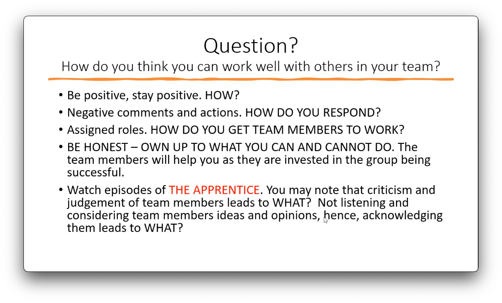

# Web Development

## TODOS

- [ ] learn about semantic markup
- [ ] learn about responsive web development
    - [ ] different types of media queries
- [ ] study CSS animations
- [ ] study CSS grids in depth
- [ ] study flexbox in depth
- [ ] study 3D transforms
- [ ] study CSS filters and blend modes
    - [ ] https://css-tricks.com/basics-css-blend-modes/
- [ ] study a11y basics in HTML but also CSS
- [ ] study implementing swipe gesture in JS
- [ ] study mobile orientation events
    - [ ] https://developers.google.com/web/fundamentals/native-hardware/device-orientation/
    - [ ] https://developer.mozilla.org/en-US/docs/Web/API/Window/orientationchange_event (deprecated)

## Feedback

- Update the course to use discussion prompts instead of directing students to forums, this will increase engagement with the topic and encourage communication
- Update the videos to NOT place the `<footer>` tag outside of the `<body>`
- Have more hands-on video examples in the HTML part of the course, like the JS part has

## Week 1

- Lecturer: Nick Hine
- the web, web pages, web sites, search engines, navigation, domain names, links
- 2018: 1.9 billion web sites, 500 million active websites, couple billion people with internet access (~4 billion)
- web content, semantic elements

### Tips

- 10h - 12h per topic, rest of the time spent on coursework:
    - group project and individual essay - 15h
    - individual project and report - 35h
- Development Software - https://replit.com/
- Design Software
    - https://moqups.com/
    - https://balsamiq.com/ (PAID)
    - https://draw.io/
    - https://www.visual-paradigm.com/

## Week 2

- DOM - Document Object Model

## Week 3

- Designing a web site: drawing, layout, page elements
- Design avoids the waste of time and money that happens after the "let it happen" approach
- Design:
    - identifies requirements
    - prevents backtracking
- Design thinking:
    - Empathize - Who is my user? What matters to this person?
    - Define - What are their needs?
    - Ideate - Brainstorm creative solutions
    - Prototype
    - Test - What worked and what didn't?
- Good design supports a function of the object being designed.
- User centric design - The Design of Everyday Things
- Wireframes to describe the layout of the content, the sections of the page, type of info in the sections.

## Week 4

- HTML - page structure
- Hypertext - Text with references (hyperlinks) to other pages or resources.
- Semantics in page design: document level semantics (`<navbar>`), group level (`<ul>`, `<p>`), text level (`<b>`, `<em>`).
- CSS - styling
- Responsive Web Design
- The design process
    - Planning the design - identifying the purpose of the website and who will be using the site
    - Capture the design - building wireframes
    - Putting the skeleton on the design - building the HTML that will receive the content
    - Styling - applied to the HTML skeleton

### Team assignment

Design and build a web site for a theme park, 3 pages minimum, only HTML and CSS will be marked.

#### TO DO
- Keep a diary of your activities and your team members activities within the group for your reflective essay.
    - roles and contributions
    - positive aspects of your team work
    - negative aspects of your team work
    - effects of team work on the quality of the work
    - tools used and research resources
- Roles and contributions
    - Find out the skills of all members in relation to the assignment
    - Previous/current experience in teams and managing people
    - Figure out the roles within the team: project manager, analyst, designer, developer, technical lead, tester **OR** these could be activities that specify who did what.
- Put as much detail as possible into documenting each step/requirement of the project. Provide evidence of communication and collaboration.
- Comment your code - HTML, CSS, JS
- Pay attention to accessibility best practices: alt tags, a11y checker, color contrast
- Structure code in directories: Stylesheets, Scripts, Images, etc.
- Use a variety of fonts, animation



## Week 5

- Introduction to HTML, HTML syntax, HTML head
- The goals of HTML
    - Platform independence
    - Hypertext - text resources linked together by hyperlinks
    - Hypermedia - pages that pull in different types of media: images, audio, video
- Markup - extra information added to content so the browser knows how to display and interpret that content.

## Week 6

- HTML body: formatting tags, layout tags, semantic tags, media tags, tables

## Week 7

**TO DO** Research CSS1 specification: https://www.w3.org/TR/CSS1/

### Introduction to CSS

- Types of styles: inline styles, embedded styles (in the head), stylesheets, default browser styles
- cascading styles precedence: default styles < external styles < embedded styles < inline styles
- `<link rel="stylesheet" type="text/css" href="....">`
- Types of CSS selectors: https://www.w3schools.com/cssref/css_selectors.asp
- Long term maintenance: semantic IDs and classes
- "CSS Diner" Selector Practice: https://flukeout.github.io/
- Text styling
    - The Beauty and Ugliness in Type Design: https://web.archive.org/web/20171022004919/https://www.aiga.org/beauty-and-ugliness-type-design-karloff
    - Typography for the Web: Webinar Recap and Resources: https://web.archive.org/web/20190108204202/https://www.aiga.org/aiga/content/inspiration/typography-for-the-web-webinar-recap-and-resources/

## Week 8

- CSS colouring - `color` property, named colours, hex colours, RGB, HSL


## Week 9

- Layout, positioning, measurement, animations
- CSS box model
    - content > padding > border > margin
    - by default the CSS width and height properties control the size of the content
    - inline, block display
    - properties: `border`, `border-radius`, `outline`, `border-image`, `border-style`, `background`, `box-shadow`
- CSS Positioning
    - X, Y, Z positioning
    - properties: `position`, `float`
    - grids and columns

### CSS Grid

- parent defines grid layout: `position: grid`, `grid-template-rows`, `grid-template-columns`, `grid-template-areas`
- child is placed in the grid: `grid-column`, `grid-row` OR `grid-area`

## Week 9

- Styling media and animations
    - properties: `opacity`, `filter`, `transform`, `@keyframes`
    - buttons: `:hover` - hover state communicates to the user that the button is an interactive element on the page
    - `<object>`

## Week 11

- Responsive Web Development, `@media` queries

## Week 12

- CSS frameworks, cascading styles
    - Frameworks when used indiscriminately, websites take on the familiar appearance associated with one framework or another.
    - Use a framework to enhance a predefined design rather than letting the framework dictate the design.
- Styling for accessibility
    - Not only for impaired users but also for scenarios like a dimly lit screen on a sunny day
    - Strong contrast between colors
    - Legibility of text 
        - should be legible on high resolution displays
        - don't use hard to read fonts
    - Explanatory text for images and graphics

## Week 13

- Introduction to JavaScript
- Client side languages vs Server side languages
- Adding dynamic elements to a page

```js
document.addEventListener('DOMContentLoaded', () => {
    for (let i = 0; i < 3; i++) {
        let button = document.createElement('button');
        button.textContent = 'click me!';
        document.body.appendChild(button);
    }

    const buttons = document.querySelectorAll('button');

    for (const button of buttons) {
        button.addEventListener('click', showMessage);
    }

    function showMessage() {
        document.body.append('button was clicked');
    }
});
```

## Week 14

- Selecting DOM elements
- Updating the content of DOM elements: `element.insertAdjacentHTML(position, text)`
- Setting element style: `element.style.color = "red"`
    - Every CSS property has a JS equivalent, ex: `text-align -> element.style.textAlign`
    - Setting multiple properties at once: `element.setAttribute("style", "color: red; text-align: center")`
- HTML attributes have equivalent JS attributes: `element.onclick = function() {...}`, `element.className = "foo"`

## Week 15

### JavaScript events

- Event flow - clicking on an element also means clicking on its parent and on the page body
- DOM Level 2 event flow comprised of: event capturing and event bubbling, https://javascript.info/bubbling-and-capturing
- Browsers implement event flow differently
- Events need to be attached to DOM elements if we want to perform an action when user interacts with that DOM element
- Events can be attached via event listeners (or event handlers)
    - event handlers are added via HTML attributes: `<button onclick="alert('hello world!')">Click me</button>`
    - event handlers are added via DOM properties: `element.onclick = function() { alert('hello world!') }`, others: `onsubmit`, `ontouchstart`, etc.
    - event listeners are added via a DOM property: `element.addEventListener('click', function() { alert('hello world!') });`
    - event listener add: `addEventListener(eventName, listenerFunction, [runInCapturePhase])`
    - event listener remove: `removeEventListener(eventName, listenerFunction, [runInCapturePhase])`
- The event generated by an action depend on: the DOM element where action occurs and the action taken
- Indirect events: `onload`, `onbeforeunload`, `onscroll`

### Event bubbling

- `event.target` - the "target" element that initiated the event, it doesn’t change through the bubbling process
- `this` or `event.currentTarget` - the "current" element, the one that has a currently running handler on it
- A bubbling event goes from the target element straight up. Normally it goes upwards till `<html>`, and then to `document` object, and some events even reach `window`, calling all handlers on the path
- `event.stopPropagation()` - stops the move upwards, but on the current element all other handlers will run
- `event.stopImmediatePropagation()` - stop the bubbling and prevent handlers on the current element from running
- We can write our data into the `event` object in one handler and read it in another one, so we can pass to handlers on parents information about the processing below

### Event capturing

`elem.addEventListener(..., {capture: true})`

The 3 phases of event propagation:
1. Capturing phase – the event goes down to the element.
1. Target phase – the event reached the target element.
1. Bubbling phase – the event bubbles up from the element.


## Week 16

### Mouse Events

- Mouse events: `click`, `mousedown` ,`mouseenter`, `mousemove`, `mouseover`, `mouseout` etc.
- Clickable elements: `<button>`, `<a>`, etc.
- Event object, properties: `button` (0 = left, 1 = middle, 2 = right)
- Event properties: `pageX`, `clientX`

```js
var box = document.getElementById("box");
var lastX = 0;

box.addEventListener("mousedown", boxStartResize);
window.addEventListener("mouseup", boxEndResize);

function boxStartResize(e) {
  if (e.button === 0) {
    lastX = e.clientX;
    window.addEventListener("mousemove", boxResize); 
  }
}

function boxEndResize(e) {
  window.removeEventListener("mousemove", boxResize);
}

function boxResize(e) {
  var dist = e.clientX - lastX;
  var newWidth = box.clientWidth + dist;
  
  box.style.width = newWidth + "px";
  lastX = e.clientX;
}
```

### Form Events

- context highlighting
- `focus` and `blur` events - click on element, tab on element, click on label to focus input
- a11y of HTML form elements by reacting to `focus` and `blur` events
- `change` event - select menus, radio buttons and checkboxes

### Key Events

- `keydown`, `keypress`, `keyup`
- Event properties: `key` - `v` (letter), `Enter`, `ArrowUp`, `ArrowDown`, etc.
- https://developer.mozilla.org/en-US/docs/Web/API/KeyboardEvent/code/code_values
- On Mobile key events might be tricky to react to because of different input methods

### Touch Events

- `touchstart`, `touchend`, `touchmove`
- `touchmove` implies `touchstart` event happened before it
- Event properties: `touches` (`event.touches[i].pageX`)
- `event.preventDefault()` - stops default browser behaviour after the event listener is run
    - Some events are passive and their behaviour cannot be prevented by default
    - This can be disabled with: `addEventListener(eventName, listenerFunction, {passive: false})`
- `event.stopPropagation()` - stops the event from bubbling up to next event listener

## Week 17

### Templating engines

- Server side vs client side templating
- Mustache - https://mustache.github.io/
    - logic less templating engine
- Handlebars.js - https://handlebarsjs.com/
    - extension of Mustache that adds logic
    - precompiled templates

## Week 18

### Helpers

- helpers: block helpers and tag helpers
- `Handlebars.registerHelper("name",  function() {});`
- strings returned by a helper are rendered as text and not HTML
- to get HTML output: `return new Handlebars.SafeString(output)`
- to escape a string: `Handlebars.Utils.escapeExpression(string)` or by using triple braces `{{{placeholder}}}`
- built in block helpers: `{{#each}}`, `{{#if}}`, `{{#unless}}` (opposite of if)
- custom block helpers can be defined `{{#myHelper}} ... {{/myHelper}}`
- partials 
    - named part of the template
    - simpler than a helper, doesn't compute data, just an output
    - `{{>greetings}}` and `var src = "Hello {{name}}"; Handlebars.registerPartial("greetings", src);`
    - https://handlebarsjs.com/guide/partials.html
- comments: `{{!-- NICE! --}}`, are removed after rendering
- logging levels: debug = 0, info = 1 (default), warn = 2, error = 3
- logging in JS: `Handlebars.logger.log(0, "WOW!")`, debug level log
- logging in template `{{log "YOLO"}}`

```html
<script id="template" type="template/handlebars">
    <p>{{greetings}} World<p>

    {{#if good}}
    <span>GOOD!</span>
    {{/if}}

    {{#each items}}
    <span>{{this}}</span>
    {{/each}}
</script>

<span id="target"></span>

<script>
    var src = document.getElementById("template").innerHTML;
    var template = Handlebars.compile(greetsrc);
    Handlebars.registerHelper("greetings", function(options) {
        switch (options.data.language) {
            case "en": 
                return "Hello"
            default:
                return "YOLO"
        }
    });
    var rendered = template({
        good: true,
        items: ["A", "B", "C"]
    }, {
        data: {language: "en"}
    });
    document.getElementById("target").innerHTML = rendered;
</script>
```

## Week 19

Web hosting, IPs, home server vs commercial server, domain names

## Week 20

Code of conduct, BCS, The Chartered Institute for IT
